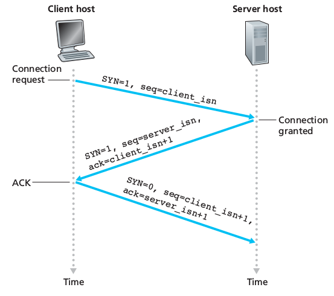

# Chapter 2: Application Layer
Network applications are the *raison d'être* of a computer network. They include  text email, remote access to computers, file transfers, the WorldWideWeb (mid 90s), web searching, e-commerce, Twitter/Facebook, Amazon, Netflix, Youtube, WoW...

## 2.1 Principles of Network Applications
At the core of network application development is writing programs that run on different **end systems** and communicate with each over the network. The programs running on end systems might be different (server-client architecture) or identical (Peer-to-Peer architecture).
Importantly we write programs that run on end systems/hosts, not on network-core devices (routers/link-layer switches).

### 2.1.1 Network Application Architectures
From the application developer's perspective, the network architecture is fixed and provides a specific set of services to applications.
The **application architecture**, on the other hand, is chosen by him. In choosing the application architecture, a developer will likely draw one of the two predominant architectural paradigms used in modern network applications:

 - **Client-server architecture**: there is an always on host, called the *server* which serves requests from many other hosts, called *clients*: [Web Browser and Web Server]. Clients do not communicate directly with each other. The server has a fixed, well-known address, called an IP address that clients use to connect to him. Often, a single server host is incapable of keeping up with all the requests from clients, for this reason, a **data center**, housing a large number of hosts, is often used to create a powerful virtual server (via *proxyin*).
 - **P2P architecture**: there is minimal or no reliance on dedicated servers in data centers, the application exploits direct communication between pairs of intermittently connected bots, called *peers*. They are end systems owned and controlled by users. [Bittorrent, Skype]. P2P applications provide **self-scalability** (the network load is distributed) They are also **cost-effective** since they don't require significant infrastructure and server bandwidth. P2P face challenges:
	1. ISP Friendly (asymmetric nature of residential ISPs)
	2. Security
	3. Incentives (convincing users to participate)

Some applications have hybrid architectures, such as for many instant messaging applications: a server keeps track of the IP addresses of users, but user-to-user messages are sent directly between users.

### 2.1.2 Processes Communicating
In the jargon of operating systems, it's not programs but **processes** that communicate. A process can be thought of as a program that is running within an end system.
Processes on two different end systems communicate with each other by exchanging **messages** across the computer network: a sending process creates and sends messages into the network, a receiving process receives these messages and possibly responds by sending messages back.

#### Client and Server Processes
A network application consists of pairs of processes that send messages to each other over a network. For each pair of communicating processes we label:

 - the process that initiates the communication as the **client** [web browser]
 - the process that waits to be contacted to begin the session as the **server** [web server]

This labels stand even for P2P applications in the *context of a communication session*.

#### The Interface Between the Process and the Computer Network
A process sends messages into, and receives messages from, the network through a software interface called a **socket**.
**A socket is the interface between the application layer and the transport layer within a host**, it is also referred to as the **Application Programming Interface** (**API**) between the application and the network.
The application developer has control of everything on the application-layer of the socket but has little control of the transport-layer side of the socket. The only control that he has over the transport-layer is:

 1. The choice of the transport protocol
 2. Perhaps the ability to fix a few transport-layer parameters such as maximum buffer and maximum segment sizes

#### Addressing Processes
In order for a process running on one host to send packets to a process running on another host, the receiving process needs to have an address. To identify the receiving processes, two pieces of information need to be specified:

 1. The address of the host. In the Internet, the host is identified by its **IP Address**, a 32-bit (or 64) quantity that identifies the host uniquely.
 2. An identifier that specifies the receiving process in the destination host: the destination **port number**. Popular applications have been assigned specific port numbers (web server -> 80)

### 2.1.3 Transport Services Available to Applications
What are the services that a transport-layer protocol can offer to applications invoking it?

#### Reliable Data Transfer
For many applications, such as email, file transfer, web document transfers and financial applications, packet's drops and data loss can have devastating consequences. If a protocol provides guarantees that the data sent is delivered completely and correctly, it is said to provide **reliable data transfer**. The sending process can just pass its data into the socket and know with complete confidence that the data will arrive without errors at the receiving process.

#### Throughput
A transport-layer protocol could provide guaranteed available throughput at some specific rate. Applications that have throughput requirements are said to be **bandwidth-sensitive applications**.

#### Timing
A transport-layer protocol can also provide timing guarantees. Example: guarantees that every bit the sender pumps into the socket arrives at the receiver's socket no more than 100 msec later, interesting for real-time applications such as telephony, virtual environments...

#### Security
A transport-layer protocol can provide an application with one or more security services. It could encrypt all data transmitted by sending process and in the receiving host decrypt it.

### 2.1.4 Transport Services Provided by the Internet
The Internet makes two transport protocols available to applications: TCP and UDP.

#### TCP Services
TCP includes a connection-oriented service and a reliable data transfer service:

 - **Connection-oriented service**: client and server exchange transport-layer control information *before* the application-level messages begin to flow. This so-called *handshaking* procedure alerts the client and server, allowing them to prepare for an onslaught of packets. Then a **TCP connection** is said to exist between the sockets of the two processes. When the application finishes sending messages, it must tear down the connection

##### SECURING TCP
Nether TCP nor UDP provide encryption. Therefore the Internet community has developed an enhancement for TCP called **Secure Sockets Layer (SSL)**, which not only does everything that traditional TCP does but also provides critical process-to-process security services including *encryption*, *data integrity* and *end-point authentication*. It is not a third protocol, but an enhancement of TCP, **the enhancement being implemented in the application layer** in both the client and the server side of the application (highly optimized libraries exist). SSL has its own socket API, similar to the traditional one. Sending processes passes cleartext data to the SSL socket which encrypts it.

 - **Reliable data transfer service** The communicating processes can rely on TCP to deliver all data sent without error and in the proper order.

TCP also includes a **congestion-control mechanism**, a service for the general welfare of the Internet rather than for the direct benefit of the communicating processes. It throttles a sending process when the network is congested between sender and receiver.

#### UDP Services
UDP is a no-frills, lightweight transport protocol, providing minimal services. It is connectionless, there's no handshaking. The data transfer is unreliable: there are no guarantees that the message sent will ever reach the receiving process. Furthermore messages may arrive out of order. UDP does not provide a congestion-control mechanism neither.

#### Services Not Provided by Internet Transport Protocols
These two protocols do not provide timing or throughput guarantees, services not provided by today's Internet transport protocols. We therefore design applications to cope, to the greatest extent possible, with this lack of guarantees.


### 2.1.5 Application-Layer Protocols
An **application-layer protocol** defines how an application's processes, running on different end systems, pass messages to each other. It defines:

 - The type of the messages exchanged (request/response)
 - The syntax of the various message types
 - The semantics of the fields (meaning of the information in fields)
 - The rules for determining whem and how a process sends messages and responds to messages

## 2.2 The Web and HTTP
In the early 1990s, a major new application arrived on the scene: the World Wide Web (Berners-Lee 1994), the first application that caught the general public's eye.
The Web operates *on demand*: users receives what they want, when they want it.
It is enormously easy for an individual to make information available over the web, hyperlinks and search engines help us navigate through the ocean of web sites...

### 2.2.1 Overview of HTTP
The **HyperText Transfer Protocol (HTTP)**, the Web's application-layer protocol is a the heart of the Web. It is implemented in two programs: a client program and a server program.
The two programs talk to each other by exchanging HTTP messages.
A **Web page** (or document) consists of objects. An **object** is simply a file (HTML file, jpeg image...) that is *addressable by a single URL*.
Most Web pages consist of a **base HTML file** and several referenced objects. The HTML file references the other objects in the page with the objects' URLs.
Each URL has two components: the hostname of the server that houses the object and the object's path name.
**Web Browsers** implement the client side of HTTP.
**HTTP** uses TCP as its underlying transport protocol.
The server sends requested files to clients without storing any state information about the client: it is a **stateless protocol**

### 2.2.2 Non-Persistent and Persistent Connections
In many Internet applications, the client and server communicate for an extended period of time, depending on the application and on how the application is being used, the series of requests may be back-to-back, periodically at regular intervals or intermittently. When this is happening over TCP, the developer must take an important decision: should each request/response pair be sent over a *separate* TCP connection or should all of the requests and their corresponding responses be sent over the *same* TCP connection?
In the former approach, the application is said to use **non-persistent connections** and in the latter it is said to use **persistent connections**
By default HTTP uses non-persistent connections but can be configured to be use persistent connections.
To estimate the amount of time that elapses when a client requests the base HTML file until the entire file is received by the client we define the **round-trip time** (**RTT**) which is the time it takes for a small packet to travel from client to server and then back to the client.

#### HTTP with Non-Persistent Connections
For the page and each object it contains, a TCP connection must be opened (handshake request, handshake answer), we therefore observe an addition RTT, and for each object we will have a request followed by the reply
This model can be expensive on the server side: a new connection needs to be established for each requested object, for each connection a TCP buffer must be allocated along some memory to store TCP variables.

#### HTTP with Persistent Connections
The server leaves the TCP connection open after sending a response, subsequent requests and responses between the same client and server will be sent over the same connection. In particular an entire web page (text + objects) ca be sent over a single persistent TCP connection, multiple web pages residing on the same server can be sent from the server to the same client over a single persistent TCP connection.
**These requests can be make back-to-back** without waiting for replies to pending requests (**pipelining**).
When the server receives back-to-back requests, it sends the objects back-to-back.
If connection isn't used for a pre-decided amount of time, it will be closed.


### 2.2.3 HTTP Message Format
Two types of HTTP messages:

#### HTTP Request Message

```
GET /somedir/page.html HTTP/1.1
Host: www.someschool.edu
Connection: close
User-agent: Mozilla/5.0
Accept-language: fr
```

 - Ordinary ASCII text
 - First line: **request line**
 - Other lines: **header lines**
 - the first lines has 3 fields: method field, URL field, HTTP version field:
	- method field possible values: `GET, POST, HEAD, PUT, DELETE`

The majority of HTTP requests use the GET method, used to request an object.


 The entity body (empty with `GET`) is used by the `POST` method, for example for filling out forms. The user is still requesting a Web page but the specific contents of the page depend on what the user entered into the form fields. When `POST` is used, the entity body contains what the user entered into the form fields.
Requests can also be made with `GET` including the inputted data in the requested URL.
The `HEAD` method is similar to `GET`, when a server receives it, it responds with an HTTP message but it leaves out the requested object. It is often used for debugging.
`PUT` is often used in conjunction with web publishing tools, to allow users to upload an object to a specific path on the web servers.
Finally, `DELETE` allows a user or application to delete an object on a web server.

#### HTTP Response Message
A typical HTTP response message:

```
HTTP/1.1 200 OK
Connection: close
Date: ...
Server: ...
Last-Modified: ...
Content-Length: ...
Content-Type: text/html

(data data data data data ...)
```
 - Status line: protocol version, status code, corresponding status message
 - six header lines:
 	- the connection will be closed after sending the message
	- date and time when the response was created (when the server retrieves the object from the file system, insert object in the message, sends the response message)
	- Type of the server / software
	- Last modified: useful for object caching
	- Content-Length: number of bytes in the object
	- Content-Type
 - entity body: contains the requested object itself (data)

Some common status codes:
 - `200 OK`: request succeeded, information returned
 - `301 Moved Permanently`: the object has moved, the new location is specified in the header of the response
 - `400 Bad Request`: generic error code, request not understood
 - `404 Not Found`: The requested document doesn't exist on the server
 - `505 HTTP Version Not Supported`: The requested HTTP protocol version is not supported by the server

### 2.2.4 User-Server Interaction: Cookies
An HTTP server is *stateless* in order to simplify server design and improves performances. A website can identify users using **cookies**.
Cookie technology has 4 components:

 1. Cookie header in HTTP response message
 2. Cookie header in HTTP request message
 3. Cookie file on the user's end-system managed by the browser
 4. Back-end database at the Website

User connects to website using cookies:

 - Server creates a unique identification number and creates an entry in its back-end database indexed by the identification number
 -server responds to user's browser including in the header: `Set-cookie: identification number`
 - The browser will append to the cookie file the hostname of the server and the identification number header
 - Each time the browser will request a page, it will consult the cookie file, extract the identification number for the site and put a cookie header line including the identification number

The server can track the user's activity: it knows exactly what pages, in which order and at what times that identification number has visited. This is also why cookies are controversial: a website can learn a lot about a user and sell this information to a third party.

Therefore **cookies can be used to create a user session layer on top of stateless HTTP**.

### 2.2.5 Web Caching
A **Web cache**, also called **proxy server** is a network entity that satisfies HTTP requests on behalf of an origin Web server. It has its own disk storage and keeps copies of recently requested objects in this storage.

 1. The browser establishes a TCP connection to the web cache, sending an HTTP request for the object to the Web cache.
 2. The web cache checks to see if it has a copy of the object stored locally. If yes, it will return it within an HTTP response message to the browser.
 3. If not, the Web cache opens a TCP connection to the origin server, which responds with the requested object.
 4. The Web caches receives the object, stores a copy in its storage and sends a copy, within an HTTP response message, to the browser over the existing TCP connection.

Therefore a **cache is both a server and a client at the same time**.
Usually caches are purchased and installed by ISPs.
They can substantially reduce the response time for a client request and substantially reduce traffic on an institution's access link to the Internet.

Through the use of **Content Distribution Networks (CDNs)** web caches are increasingly playing an important role in the Internet. A CDN installs many geographically distributed caches throughout the Internet, localizing much of the traffic.

### 2.2.6 The Conditional `GET`
Caches introduce a new problem: what if the copy of an object residing in the cache is stale?
The **conditional GET** is used to verify that an object is up to date.
An HTTP request message is a conditional get if

 1. the request message uses the `GET` method
 2. the request message includes an `If-modified-since:` header line.

A conditional get message is sent from the cache to server which responds only if the object has been modified.

## 2.4 Electronic Mail in the Internet
It has three components, the user agents, the mail servers and the SMTP. Mail servers form the core of the e-mail infrastructure. An email starts in the sender's user agent, travels to sender's mail server, travels to recipient's mail server and ends up in the recipient's mailbox. If email cannot be delivered it stays in a message queue and the server attemts to transfer the message later. 

### 2.4.1 SMTP
It uses the reliable data transfer service of TCP to trainsfer mail. It restricts the body of all mail messages to simple 7-ASCII. It doesn't use intermediate mail servers for sending mails, even if one of the 2 servers that are communicating is down and it connects the 2 servers directly with each other.

**How SMTP transfers a mail:**

- The client SMTP has TCP establish a connection a connection at server SMTP. If the server is down it tries again later.
- Once this connection is established the server and client perform some application layer handshaking in order to introduce themselves. During this phase SMTP introduces the email address of the recipient and the sender.
- Then the client sends the message and the exchange of messages occurs.
- When finished the TCP is instructed to close the connection.

SMTP uses persistent connections: if the server sends several messages to the same receiving mail server, it can send all of the messages over the same TCP connection.

### 2.4.2 Comparison with HTTP
Both protocols transfer files; HTTP from Web server to a Web client and SMTP from one mail server to another mail server. Both of the protocols use perisistent connections when transferring files. However there are 3 differences:

1. HTTP is mainly a pull protocol; the TCP connection is initiated by the machine that wants to receive the file. SMTP is a push protocol; the TCP connection is initiated by the machine that wants to send the file
2. SMTP requires each message to be in 7-bit ASCII. HTTP does not impose this restriction. 
3. When handling a document consisting of text and images HTTP encapsulates each object in each own HTTP response message, while internet mail places all of the messages' objects into one message.

### 2.4.4 Mail Access Protocols
Mail access uses a client-server architecture, so the user reads emails with a client that executes on the user's end sustem. An email server manages mailboxes and runs the client and server sides of SMTP, so a user runs a user agent on the local PC but accesses its mailbox stores on an always-on shared mail server. An email is first sent to the sender's mail server and stored there in case that the recipient's server is not available. SMTP is a push protocol so it is used to transfer mail from the sender's mail server to the sender's user agent. A mail access protocol, such as POP3, is used to transfer mail from the recipient's server to the recipient's mail server to the recipient's user agent.

#### POP3 
A simple mail access protocol with 3 phases:

1. First phase is called authorization and the user agent sends a username and a password in order to authenticate the user.
2. During the second phase, transaction, the user agent retrieves the message and can mark messages for deletion.
3. The third phase, update, occurs after the the client has issued the quit command, ending the POP3 session. At the same time the mail server deletes the messages that were marked for deletion.

During a POP3 session the POP3 server maintains some state information but it does not carry state information across POP3 sessions.

#### IMAP
POP3 protocol does not provide any means for a user to create remote folders and assign messages to folders. IMAP is a mail protocol that has more features and it is more complicated than POP3. IMAP will associate every message with a folder, hence when a message first arrives at the server it is associated with the receiver's INBOX folder. The IMAP protocol provides commands to allow users to create folders and move messages from one folder to another. It also allows users to search folders for messages. Unlike POP3, it maintains user state information across IMAP sessions. Also it has commands that perimit users to obtain components of messages, a useful feature for low-bandwidth connection.

## 2.6 Peer-to-Peer Applications

### 2.6.1 File Distribution
In P2P file distribution, each peer can redistribute any portion of the file it has received to any peers, thereby assisting the server in the distribution process. As of 2012 the most popular P2P file distribution protocol is BitTorrent, developed by Bram Cohen.

#### Scalability of P2P architectures
Denote the upload rate of the server's access link by $u_s$, the upload rate of the *i*th peer's access link by $u_i$ and the download rate of the *i*th access link by $d_i$, tthe size of the to be distributed in bits ()
Comparison client-server and P2P.

#### Client-Server
The server must transmit one copy of the file to *N* peers, thus it transmits *NF *bits. The time to distribute the file is at least **NF/u_s**.
Denote $d_min = min\{ d_i \}$ the link with the slowest download rate cannot obtain all *F* bits in less than $F/d_min$ seconds
Therefore:
$$ D_{cs} \geq \max \left\{ \frac{NF}{u_s} , \frac{F}{d_min} \right\} $$

#### P2P
When a peer receives some file data, it can use its own upload capacity to redistribute the data to other peers.

 - At the beginning of the distribution only the server has the file. It must send all the bits at least once. $D \geq F/u_s$
 - The peer with the lowest download rate cannot obtain all *F* bits of the file in less than $F/d_min $ seconds.
 - The total upload capacity of the system is equal to the summation of the upload rates of the server and of all the peers. The system must upload *F* bits to *N* peers, thus delivering a total of *NF* bits which can't be done faster that $u_total$.

We obtain:
$$ D_{P2P} = \max \left\{ \frac{F}{u_s} , \frac{F}{d_{min}} , \frac{NF}{u_s + \sum_{i=1}^N u_j} \right\} $$

#### BitTorrent
In BitTorrent the collection of all peers participating in the distribution of a particular file is called a *torrent*. Peers in a torrent download equal-size *chunks* of the file from one another with a typical chunk size of 256 KBytes.
At the beginning a peer has no chunks, it accumulates more and more chunks over time. While it downloads chunks it also uploads chunks to other peers. Once a peer has acquired the entire file it may leave the torrent or remain in it and continue to upload chunks to other peers (becoming a *seeder*). Any peer can leave the torrent at any time and later rejoin it at anytime as well.

Each torrent has an infrastructure node called a *tracker*: when a peer joins a torrent, it registers itself with the tracker and periodically informs it that it is still in the torrent. The tracker keeps track of the peers participating in the torrent. A torrent can have up to thousands of peers participating at any instant of time.

User joins the torrent, the tracker randomly selects a subset of peers from the set of participating peers. User establishes concurrent TCP connections with all of these peers, called *neighboring peers*. The neighboring peers can change over time.
The user will ask each of his neighboring peers for the list of chunks they have (one list per neighbor).
The user starts downloading the chunks that have the fewest repeated copies among the neighbors (**rares first** technique). In this manner the rarest chunks get more quickly redistributed, roughly equalizing the numbers of copies of each chunk in the torrent.


Every 10 seconds the user measures the rate at which she receives bits and determines the four peers that are sending to her at the highest rate. It then reciprocates by sending chunks to these same four peers. The four peers are called **unchocked**. Every 30 seconds it also choses one additional neighbor and sends it chunks. These peers are called **optmistically unchocked**.

### 2.6.2 Distributed Hash Tables (DHTs)
How to implement a simple database in a P2P network?
In the P2P system each peer will only hold a small subset of the totality of the (key, value) pairs. Any peer can query the distributed database with a particular key, the database will locate the peers that have the corresponding pair and return the pair to querying peer. Any peer can also insert a new pair in the databse. Such a distributed database is referred to as a **distributed hash table (DHT)**.
In a P2P file sharing application a DHT can be used to store the chunks associated to the IP of the peer in possession of them.

###### An approach:
Let's assign an identifier to each peer, where the identifier is an integer in the range __`[0, 2^n -1]`__ for some fixed __`n`__. Such an identifier can be expressed by a __`n-bit`__ representation. A hash function is used to transform non-integer values into integer values. We suppose that this function is available to all peers.
__How to assign keys to peers?__ We assign each `(key,value)` pair to the peer ***whose identifier is the closest to key***, which is the identifier defined as ***the closest successor of the key***.
To avoid having each peer keeping track of all other peers (scalability issue) we use

#### Circular DHT
If we organize peers into a circle, each peer only keeps track of its immediate successor and predecessor __(modulo `2^n`)__. This circular arrangement of peers is a special case of an **overlay network**: the peers form an abstract logical network which resides above the "underlay" computer network, the overlay links are not physical but virtual liaisons between pairs of peers. A single overlay link typically uses many physical links and physical routers in the underlying network.

In the circle a peer asks "who is responsible for key *k*?" and it sends the message clockwise around the circle. Whenever a peer receives such message, it knows the identifier of its predecessor and predecessor, it can determine whether it is responsible (closest to) for the key in question. If not, it passes the message to its successor. When the message reaches the peer responsible for the key, it can send a message back to the querying peer indicating that it is responsible for that key.
Using this system __`N/2*`__ messages are sent on average __(N = number of peers)__. In designing a DHT there is always a tradeoff between the number of neighbors for each peer and the number of DHT messages needed to resolve a single query. (1 message if each peer keeps track of all other peers; **`N/2`** messages if each knows only 2 neighbors).
To improve our circular DHT we could add shortcuts so that each peer not only keeps track of its immediate successor and predecessor but also of relatively small number of shortcut peers scattered around the circle.
__How many shortcut neighbors?__ Studies show that DHT can be designed so that the number of neighbors per peer as well as the number of messages per query is __`O(log *N*)` (`N` the number of peers)__.

#### Peer Churn
In a P2P system, a peer can come or go without warning. To keep the DHT overlay in place in presence of a such peer churn we require each peer to keep track (know to IP address) of its predecessor and successor, and to periodically verify that its two successors are alive.
If a peer abruptly leaves, its successor and predecessor need to update their information. The predecessor replaces its first successor with its second successor and ask it for the identifier and IP address of its immediate successor.

What if a peer joins? If it only knows one peer, it will ask him what will be his predecessor and successor. The message will reach the predecessor which will send the new arrived its predecessor and successor information. The new arrived can join the DHT making its predecessor successor its own successor and by notifying its predecessor to change its successor information.

## 2.7 Socket Programming: Creating Network Applications
Only code explication ----> skipping

# Chapter 3: Transport Layer

## 3.1 Introduction and Transport-Layer Services

A transport-layer protocol provides for **logical communication** (as if the hosts running the processes were directly connected) between application processes running on different hosts. Application processes use the logical communication provided by the transport layer to send messages to each other, free from the worry of the details of the physical infrastructure used.
**Transport-layer protocols are implemented in the end systems but not in network routers**.
On the sending side, the transport layer converts the application messages into transport-layer packets, known as transport-layer **segments**. This is done by breaking them into smaller chunks and adding a transport-layer header to each chunk. The transport-layer then passes the segment to the network-layer packet at the sending end-system.
On the receiving side, the network layer extracts the transport-layer segment from the datagram and passes the segment up to the transport-layer which then processes the received segment, making the data in the segment available to the received application.

### 3.1.1 Relationship Between Transport and Network Layers
A transport-layer protocol provides logical communication between __*processes*__ running on different hosts. Whereas a network-layer protocol provides logical communication between __*hosts*__.

### 3.1.2 Overview of the Transport Layer in the Internet
A TCP/IP network (such as the Internet) makes two distinct transport-layer protocols available to the application layer:

 - **UDP** [ **U**ser **D**atagram **P**rotocol], which provides an unreliable, connectionless service to the invoking application
 - **TCP** [**T**ransmission **C**ontrol **P**rotocol] which provides a reliable, connection-oriented service to the invoking application.

We need to spend a few words on the network-layer protocol: the Internet network-layer protocol is the IP (Internet Protocol). It provides a logical communication between hosts. The IP service model is a **best-effort delivery service**: it makes the best effort to deliver segments between hosts, *but it __doesnt__ provide guarantees*:

 - it doesn't guarantee segment **delivery**
 - it doesn't guarantee **orderly** delivery of segments
 - it doesn't guarantee the **integrity** of the data in the segments

Thus IP is said to be an **unreliable service**.
Every host has **at least one network-layer address** a so-called IP address.

UDP and TCP extend IP's delivery service between 2 end systems to a delivery service between two processes running on the end systems.
Extend host-to-host delivery to process-to-process delivery is called **transport-layer multiplexing and demultiplexing**.
UDP provides process-to-process delivery and error checking services. Therefore it is an __unreliable service__.
TCP provides **reliable data transfer** using flow control, sequence numbers, acknowledgements and timers. **TCP thus converts IP's unreliable service between end systems into a reliable data transport service between processes**.
TCP also provides **congestion control**, a service not really provided to the invoking application as it is to the Internet as a whole: **it prevents any TCP connection from swamping the links and routers between communication hosts with an excessive amount of traffic giving each connection traversing a congested link an equal share of the bandwidth.**

## 3.2 Multiplexing and Demultiplexing
Here we'll cover multiplexing & demultiplexing in the context of the Internet but **a multiplexing/demultiplexing service is needed for all computer networks**.

 - The job of delivering the data in a transport-layer segment to the correct socket is called **demultiplexing**.
 - The job of gathering data chunks at the source host from different sockets, encapsulating each data chunk with header information (which will be used in demultiplexing) to create segments and passing the segments to the networks layer is called **multiplexing**.

 Therefore sockets need to have unique identifiers and each segment needs to have special fields that indicate the socket to which the segment is delivered. These fields are the **source port number field** and the **destination port number field**. Each port number is a **16-bit number** ranging from 0 to 65535.
 Port numbers ranging from 0 to 1023 are called **well-known port numbers** and are restricted, reserved for us by well-known application protocols such as HTTP (80) and FTP (21). Designing an application, we should assign it a port number.

#### Connectionless Multiplexing and Demultiplexing
A UDP socket is fully identified by the **two-tuple**:
`(destination IP address , destination port number)`
therefore if two UDP segments have different source IP address and/or source port numbers but have the same destination IP address and destination port number, than the two segments will be directed to the same destination process via the same destination socket.
The source port number serves as part of the __`return address`__.

#### Connection-oriented Multiplexing and Demultiplexing
A TCP socket is identified by the **four-tuple**:
`(source IP address, source port number, destination IP address, destination port number)`
When a TCP segment arrives from the network to a host, the **host uses all four values to demultiplex the segment to the appropriate socket**.
Two arriving TCP segments with different source IP addresses or source port numbers will (with the exception of a TCP carrying the original connection establishment request) be directed to two different sockets.

Routine:

 - The TCP server application always has a **welcoming socket** that waits for connection establishment requests from TCP clients on port number `X`
 - The TCP client creates a socket and sends a connection **establishment request** (a TCP segment including destination port, source port number and *a special connection-establishment bit set in the TCP header*)
 - The server OS receives the incoming connection-request segment on port `X`, it locates the server process that is waiting to accept a connection on port number `X`, then creates **a new socket** which will be identified by
 `(source port number in the segment (cleint), IP address of source host (client), the destination port number in the segment (its own), its own IP address)`
 - With the TCP connection in place, client and server can now send data to each other

The server may support many simultaneous TCP connection sockets, with each socket attached to a process and each socket identified by its own four-tuple.
When a TCP segment arrives at the host, all the fours fields are used to demultiplex the segment to the appropriate socket.

##### Port Scanning
Can be used both by attackers and system administrator to find vulnerabilities in the target or to know network applications are running in the network.
The most used port scanner is **nmap** free and open source.
For TCP it scans port looking for port accepting connections, for UDP looking for UDP ports that respond to transmitted UDP segments.
It then returns a list of open, closed or unreachable ports.
A host running nmap can attempt to scan any target *anywhere* in the Internet

#### Web Servers and TCP
In a web server, all segments have destination port 80 and both the initial connection-establishment segments and the segments carrying HTTP request messages will have destination port 80, the server will distinguish clients using the source IP addresses and port numbers.
Moreover in today's high-performing Web, servers often use only one process and *create a new thread with a new connection soket for each new client connection*.

If using persistent HTTP, client and server will exchange messages via the same server socket. If using non-persistent HTTP, a new TCP connection is created and closed for every request/response and hence a new socket is created and closed for every request/response.

## 3.3 Connectionless Transport: UDP
UDP does multiplexing/demultiplexing, light error checking, nothing more. If the developer chooses UDP, the application is almost directly talking with IP.
Note that with UDP there is no handshaking between sending and receiving transport-layer entities before sending a segment. For this reason UDP is said to be **connectionless**.
DNS is an example of an application layer protocol that typically uses UDP: there is no handshaking and when a client doesn't receive a reply either it tries sending the query to another name server or it informs the invoking application that it can't get a reply. Why should a developer choose UDP?

 - *Finer application-level controll over what data is sent and when*: as soon as the application passes data to UDP, UDP will package the data inside a segment and immediately pass it to the network layer. TCP's congestion control can delay the sending of the segment and will try sending the packet until this is received. In real time applications the sending rate is important, so we can trade off some data loss for some sending rate.
 - *No connection establishement* UDP justs send data without any formal preliminaries without introducing any delay, probably the reason why DNS runs over UDP.
 - *No connection state*: because a UDP application doesn't need to keep track of the users or to keep connections alive, it can typically support many more active clients than a TCP application
 - *Small packet header overhead* TCP has 20 bytes of header overhead in every segment versus the 8 of UDP

It is possible for an application developer to have reliable data transfer when using UDP. This can be done if reliability is built into the application itself (eg adding acknowledgement and retransmission mechanisms) but it is a nontrivial task and may keep the developer busy for a long time.

### 3.3.1 UDP Segment Structure


The UDP header has only four fields, each consisting of two bytes: 
 - `source port number`
 - `destination port number`
 - `checksum` (used for error detection.)
 - `length` (which specifies the number of bytes in the UDP segment, header + data)
 
This `length` field is needed since the size of the data field may differ from one UDP segment to the next.

### 3.3.2 UDP Checksum
Provides for error detection, to determine whether the bits in the segment have been altered as it moves from source to destination.

At the send side, UDP performs the 1s complement of the sum of all the 16-bit (max 64) words in the segment, with any overflow encountered during the sum being wrapped around. This result is put in the checksum field of the UDP segment header.

UDP implements error detection according to the **end-end principle**: certain functionality (error detection in this case) must be implemented on an end-end basis: "functions placed at the lower levels may be redundant or of little value when compared to the cost of providing them at the higher level".

## 3.4 Principles of Reliable Data Transfer
It is the responsibility of a **realiable data transfer protocol** to implement reliable data service: no transferred data bits are corrupted or lost and all are delivered in the order in which they were sent.
We will consider the following actions:

 - The sending side of the data transfer protocol will be invoked from above by a call to `rdt_send()`
 - On the receiving side `rdt_rcv()` will be called when a packet arrives while `deliver_data()` will be called when the `rdt` protocol wants to deliver data to the upper layer.

We use the term packet rather than segment because the concepts explained here applies to computer networks in general.
We will only consider the case of **unidirectional data transfer** that is data transfer from the sending to the receiving side. The case of reliable **bidirectional** (full-duplex) **data transfer** is not more difficult but more tedious to explain. Nonetheless sending and receiving side will need to transmit packets in *both directions*.

### 3.4.1 Building a Reliable Data Transfer Protocol
**Finite-state machine**s (FSM) are boring! And unlikely to be asked at the exam, therefore I decided not to cover them here.

### 3.4.2 Pipelined Reliable Data Transfer Protocols
In today's high-speed networks stop-and-wait protocols are simply not tolerable: we  cannot send one packet and wait for the ACK and then send the second one, it is inefficient as we can see computing the **utilization of the channel**:

$$ U = \frac{L/R}{RTT+ L/R} $$

The solution is simple: rather than operate in a stop-and-wait manner, the sender is allowed to send multiple packets without waiting for acknowledgements. Since the many in-transit send-to-receiver packets can be visualized as filling a pipeline, this technique is known as **pipelining**.

Some consequences:

 - The range of sequence numbers must be increased: **each in-transit packet must have a unique sequence number**
 - Sender and receiver may have to buffer more than one packet.

Two basic approaches toward pipelined error recovery can be identified: **Go-Back-N** and **Selective Repeat**

### 3.4.3 Go-Back-N (GBN)
The sender is allowed to send N packets (**sender window size = N**), the receiver has a window of size **1**.
If a segment from sender to receiver is lost, the receiver discards all the segments with sequence number greater than the sequence number of the dropped packet, answering with ACK with this sequence number. (no packet re-ordering)
The sender will wait for ACK in order to move the window and send new packets. The wait is not infinite, after a certain time a timeout will occur and the sender will retransmit all the packets in the sending window.
In a Go-Back-N protocol, acknowledgements are **cumulative**: if sender receives ACK3 he will know that all the packets from 0 to 3 have been received, even if hasn't received ACK2.

### 3.4.4 Selective Repeat
When the window-size and bandwidth-delay product are both large, many packets can be in the pipeline and a single packet error can thus cause GBN to retransmit a large number of packets, many unnecessarily.
**Selective Repeat** avoid unnecessary retransmissions by having the sender retransmit only those that packets it suspects were received in error at the receiver:
**individual acknowledgements** (opposed to cumulative).
**sender window size = N** and **receiver window site = N**.
The sender has a timer for each packet in its window. When a timeout occurs, only the missing packet is resent.
The receiver buffers out of order packets.

## 3.5 Conncetion-Oriented Transport: TCP
### 3.5.1 The TCP Connection
TCP is said to be **connection-oriented** because before one application process can begin to send data to another, the two processes must first "handshake" with each other. During the connection establishment, both sides of the connection will initialize many TCP state variables.
TCP connection is not an end-to-end TDM or FDM circuit nor is it a virtual circuit as **the connection state resides entirely in the two end systems** and not in the intermediate network elements.
A TCP connection provides a **full-duplex service**: when a connection between process A and process B, application layer data can flow from A to B and, at the same time, from B to A.
TCP is also **point-to-point**: a connection is always  between a *single sender* and a *single receiver*, no multicast possible.

Establishment of the connection: the client first sends a special TCP segment, the server responds with a second special TCP segment and the client answer again with a third special TCP segment. The first two cannot contain a payload while the third can. Three segments: **three-way handshake**.
Both the sender and the receiver have buffers that are set up during the handshake.
The maximum amount if data that can be grabbed and placed in a segment is limited by the **maximum segment size (MSS)**.
TCP therefore splits data into smaller chunks and pairs each chunk of client data with a TCP header thereby forming **TCP segments** which are passed down to the network layer. When TCP receives a segment at the other end, the segment's data is placed in the TCP connection's receive buffer. **Each side of the connection has its own send buffer and its own receive buffer**

### 3.5.2 TCP Segment Structure


 - 32 bit sequence number and acknowledgement number necessary for reliable data transmission
 - 16 bit **receive window** used for flow control, indicates the number of bytes that a receiver is willing to accept
 - 4 bit **header length field**. The TCP header can be of a variable length due to the TCP options field (usually empty therefore usual length is 20 bytes)
 - **options field** used to negotiate MSS or as a window scaling factor for use in high speed networks.
 - **flag field**: 6 bits:
 	1. ACK used to indicate that the value carried in the acknowledgement field is valid, that is the segment contains an acknowledgement for a segment that has been successfully received.
	2. ,  3. and 4. **RST, SYN, FIN** for connection setup and teardown
	5. **PSH** indicates that the receiver should pass the data to upper layer immediately
	6. URG indicates that there is data in the segment that the sending side upper layer has marked as urgent.

#### Sequence Numbers and Acknowledgment Numbers
TCP views data as *an unstructured, but ordered, stream of bytes* and TCP's use of sequence numbers reflects this view: sequence numbers are over the stream of bytes and not over the series of transmitted segments.
The **sequence number for a segment** is the byte-stream number of the first byte in the segment.
EX 500,000 bytes, MSS = 1,000 bytes => 500 segments are created. First is numbered 0, second 1000, third 2000.....

**The acknowledgement number** *that Host A puts in its segment is the sequence number of the next byte Host A is expecting from Host B*.
TCP is said to provide **cumulative acknowledgements**: if sender receives ACK 536 he will know that all the bytes from 0 to 535 have been well received.
What does a host do when it receives out-of-order segments? The receiver buffers the out-of-order bytes and waits for the missing bytes to fill in the gaps.
Usually both sides of a TCP connection randomly choose an initial sequence number **randomly** both for security and for minimizing the possibility that a segment that is still present in the network from an earlier, already terminated connection between two hosts is mistaken for a valid segment in a later connection between these same two hosts.

### 3.5.3 Round-Trip Time Estimation and Timeout

TCP uses a timeout/retransmit mechanism to recover from lost segments. The question rises: How long should the timeout intervals be?
Clearly the timeout should be larger than the connection's round-trip time? How much larger? How can the RTT be evaluated?

#### Estimating the Round-Trip Time
The sample RTT, `SampleRTT`, for a segment is the amount of time between when the segment is sent (passed to network layer) and when an acknowledgement for the segment is received.
Most TCP implementations take one `SampleRTT` at a time: at any point in time, the `SampleRTT` is being estimated for only one of the transmitted but currently unacknowledged segments, leading to a *new value of `SampleRTT` for approximatively every RTT*.
TCP **never computes a `SampleRTT` for a segment that has been retransmitted**, only for segments transmitted once.
In order to estimate a typical RTT, TCP keeps an average called `EstimatedRTT` of the `SampleRTT` values. Upon obtaining a new `SampleRTT` TCP updates this estimation according to the formula:

`EstimatedRTT = (1 - a) * EstimatedRTT + a * SampleRTT`

 where usually a = 1/8 = 0.125

We note that this weighted average puts more weight on recent samples than on old samples. In statistics such an average is called an **exponential weighted moving average (EWMA)**.
It is also useful to having an estimate of the *variability of the RTT*. We can measure how much `SampleRTT` typically deviates from `EstimatedRTT`:

`DevRTT = (1 - b) * DevRTT + b* | SampleRTT - EstimatedRTT |`

We note that this is an EWMA of the difference of estimated and last measured RTT. The recommended value for b is b = 0.25

#### Setting and Managing the Retransmission Timeout Interval

`TimeoutInterval = EstimatedRTT + 4 * DevRTT`

An initial `TimeoutInterval` value of 1 second is recommended.
Also **when a timeout occurs, the value of `TimeoutInterval` is doubled** in order to avoid a premature timeout occurring for a subsequent segment that will soon be acknowledged. As soon as a segment is received and `EstimatedRTT` is updated, the `TimeoutInterval` is again computed using the formula above.

### 3.5.4 Reliable Data Transfer
TCP creates a **reliable data transfer service** on top of IP's unreliable best-effort service. It ensures that the data stream that a process reads out of its TCP receive buffer is *uncorrupted, without gaps, without duplication and in sequence*.
We supposed until now that an individual timer was associated with each transmitted segment. However timer management can require considerable overhead. Thus the recommended TCP timer management procedures (defined by RFC standards) use only a ***single*** retransmission timer (it is helpful to think of the timer as being *associated with the oldest unacknowledged segment*).

 1. Upon receiving data from the application layer, TCP encapsulates it in a segment and passes to the segment to IP. If the timer is not running for some other segment, TCP starts it when the segment is passed to IP, the timer expiration interval being `TimeoutInterval`
 2. If the timeout occurs, TCP responds by **retransmitting the segment that caused the timeout** and by restarting the timer
 3. An valid acknowledgement segment is received: TCP compares the ACK `y` value with its `sendBase` (the sequence number of the oldest unacknowledged byte). If `y > sendBase` then ACK is acknowledging one or more previously unacknowledged segments (cumulative acknowledgement). The `sendBase` variable is updated and the timer is restarted if there are not-yet-acknowledged segments.

#### Doubling the Timeout Interval

Each time TCP retransmits, it sets the next timeout interval to twice the prevous value. However when the timer is restarted after receiving data from the application layer or after receiving an ACK, the `TimeoutInterval` is recomputed as described previously

#### Fast Retransmit
The problem with timeout-triggered retransmission is that the timeout period can be relatively long.
The sender can however often detect packet loss before the timeout event occurs by noting *duplicate ACKs*. A **duplicate ACK** is an ACK that reacknowledges a segment for which the sender has already received an earlier acknowledgement.
When the TCP sender receives **three duplicate ACK for the same data** it takes this as an indication that the segment following the segment that has been ACKed three times has been lost. In the case that three duplicate ACKs are received, the TCP sender performs a **fast restransmit**: it retransmits the missing segment *before* that segment's timer expires.

#### Go-Back-N or Selective Repeat?
Acknowledgments are cumulative (GBN) but many TCP implementations will buffer correctly received but out-of-order segments.
Also consider fast retransmit where only the missing packet is resent (SR) instead of all the window (GBN).
We can see that TCP's error recovery mechanism is categorized as a **hybdrid of GB and SR protocols**.

### 3.5.5 Flow Control
The host on each side of a TCP connection set aside a receive buffer for the connection. When TCP receives bytes that are correct and in sequence, it places the data in the receive buffer. The associated application process will read data from this buffer, but necessarily at the instant the data arrives (busy, not interested...). Thus the *the sender can easily overflow the connection's receive bufffer by sending too much data too quickly*. To avoid this event, TCP provides a **flow-control service**.
Flow control is a *speed-matching service*: matching the rate at which the sender is sending against the rate at which the receiving application is reading.

**Flow control and congestion control are not the same!**: the former preventing overflow at the receiver side and being actuated only by the two end points, the latter preventing congestion of the network.

TCP provides flow control by having the *sender* maintain a variable called the **receive window**, used to give the sender an idea of how much free buffer space is available at the receiver.

Host A sends a large file to Host B over TCP.

##### B side

	1. B allocates a receive buffer to its connection, its size being `RcvBuffer`
	2. B also keeps the variables: `LastByteRead` (number of last byte in the data stream read by the application process) and `LastByteRcvd` (the number of the last byte arrived from the network and placed in the receive buffer)

We have: `LastByteRcvd - LastByteRead <= RcvBuffer` (we don't want overflow!)

Receive window aka the *amount of spare room in the buffer* `rwnd = RcvBuffer -  [LastByteRcvd - LastByteRead]`
`rwnd` is dynamic

##### A side
A keeps track of two variables:

	1. `LastByteSent`
	2. `LastByteAcked`

Through the connection's life A must make sure that `LastByteSent - LastByteSent <= rwnd`

If B's buffer becomes full, he sends `rwnd = 0`.  If *B has nothing to send to A*, when the application process empties B's buffer, TCP does not send a new segment with the new value of `rwnd` to A (TCP sends to A only if it needs to send data or if it needs to send an ACK).
Therefore A is never informed that B's buffer has some free space and **he is blocked and can trasmit no more data**.
To solve this problem, TCP requires A to **continue to send segments with one data byte when B's receive window is 0**, these segments will be acknowledged by B. Eventually the buffer will begin to empty and the acknowledgements will contain à non-zero `rwnd` value.

We remember that **UDP has no flow control service**

### 3.5.6 TCP Connection Management
#### How is the connection established? **Three-way handshake**



 1. The client-side TCP sends a special TCP segment to server-side TCP. This segment **doesn't contain any application-layer data** but the **flag bit SYN is set to 1**. The segment is referred to as a *SYN segment*. The client also **randomly chooses an initial sequence number** (`client_isn`) and **puts this number in the sequence number field of the initial TCP SYN segment**. (randomizing `client_isn` is interesting to avoid security attacks).
 2. The TCP SYN segment arrives at the server-side, it is extracted from the datagram. The server allocates the TCP buffers and variables to the connection and **sends a connection-granted segment to the client**. This segment also contains no application-layer data. The **SYN flag is set to 1**, the **ACK field in the header is set to `client_isn+1`**. **The server chooses its own initial sequence number `server_isn`** and **puts this value in the sequence number field of the TCP segment header**. This segment is referred to as *SYNACK segment*.
 3. Upon receiving the SYNACK segment, the client also allocates buffers and variables to the connection. The client then **sends the server yet another segment which acknowledges the SYNACK** (`server_isn+1` is set the acknowledgement field of the TCP segment header)

After this setup, all the segments will have the SYN bit set to 0 in their headers.

#### Tearing down a TCP connection


The client decides to end the connection:

 1. The client sends a special TCP segment to the server, this special segment having the **FIN bit flag set to 1** in the header.
 2. The server receives the segment and sends an acknowledgement to the client.
 3. The server then sends its own shutdown segment which also **has the FIN bit set to 1**
 4. The client acknowledges the server's shutdown segment.
 5. The "resources" (buffers and variables) in the host**s** are deallocated.

#### What if the two ends are not ready for communication?
 A host receives a TCP segment whose port number or source IP address do not match with any of the ongoing sockets in the host -> the host sends a special reset segment to the source (RST flag bit set to 1) and drops the packet (UDP does responds with a special ICMP datagram)

## 3.6 Principles of Congestion Control

### 3.6.2 Approaches to Congestion Control
We can distinguish among them by whether the network layer provides the any explicit assistance to the trainsport layer for congestion-control purposes:

- **End-to-end congestion control**. The network layer provides no explicit support to the transport layer for congestion control purposes. The presence of congestion in the network must be inferred by the end systems based only on observed network behavior. TCP must take this approach since the IP layer provides no feedback to the end systems regarding congestion. TCP segment loss is taken as an indication of network congestion and decreases its window size accordingly. 

- **Network-assisted congestion control**. Network-layer components(routers) provide explicit feedback to the sender regarding the congestion state in the network. Simple feedback like a single bit indicating congestion at a link.

For network-assisted congestion control, congestion information is fed back from the network to the sender in two ways. First is that direct feedback may be sent from a network router to the sender, in a form of **choke packet**. The second form occurs when a router marks a field in a packet flowing from sender to receiver to indicate congestion. Upon receipt of a marked packet, the receiver then notifies the sender of the congestion indication.


## 3.7 TCP Congestion Control
TCP limits the rate at which it sends traffic into its connection as a function of perceived network congestion.
The TCP congestion-control mechanism operating at the sender keeps track of an additional variable: the **congestion window**, noted `cwnd` which imposes a constraint on the rate at which a TCP sender can send traffic into the network. Specifically: `LastByteSent - LastByteAcked <= min{cwnd, rwnd}`.
Limiting the amount of unacknowledged data at the sender we can limit the sender's send rate.
At the beginning of each RTT the sender sends `cwnd` bytes of data and at the end of the RTT he acknowledges. Thus **the sender's send rate is roughly `cwnd/RTT` bytes/sec. Adjusting the value of `cwnd` the sender can adjust the rate at which it sends data into the connection**.
Let now consider a *loss event* (timeout OR three duplicate ACKs). When there is excessive congestion some router buffers along the path overflows, causing a loss event at the sender *which is taken by the sender to be an indication of congestion on the sender-to-receiver path*.
If there is no congestion then all the acknowledgements will be received at the sender, which will take these arrivals as an indication that segments have been received and that he can increase the congestion window size and hence its transmission rate. If acknowledgements arrive at a slow rate then the congestion window will be increased at a relatively slow rate and, viceversa, it will be increased more quickly if ACKs arrive at a high rate.
Because TCP uses acknowledgements to trigger (or clock) its increase in congestion window size, TCP is said to be **self-clocking**. TCP uses the principles:

 1. *A lost segment implies congestion therefore the sender rate should be decreased.*
 2. *An acknowledged segment means the network's working, therefore the sender's rate can be increased* (if ACK of unacknowledged segment)
 3. *Bandwidth probing*: the transmission rates increases with ACKs and decreases with loss events: TCP is continuously checking (probing) the congestion state of the network

### TCP Congestion-Control Algorithm
Three components :

#### 1 - Slow Start
When a TCP connection begins, `cwnd` is usually initialized to a small value of 1 MSS and only one segment is sent. **Each acknowledged packet** will cause the `cwnd` to be increased by 1 MSS and the sender will send now two segments (because the window is increased by one for each ack).
Therefore the number of segments doubles at each RTT, therefore the sending rate also doubles every RTT. Thus TCP send rate **starts slow but grows exponentially during the slow start phase**.
When does the growth end?

 - Timeout: `cwnd` is set to 1 MSS and the slow start is started anew. Also the variable slow start threshold is initialized:
 `ssthresh = cwnd / 2 - (half of value of cwnd when congestion is detected)`
 - When `cwnd >= ssthresh` slow starts is stopped -> congestion avoidance state
 - Three duplicate ACKs: fast retransmit and fast recovery state

#### 2 - Congestion Avoidance
TCP suppose congestion is present, how to adapt?
Instead of doubling `cwnd` every RTT, `cwnd` is increased **by just a single MSS every RTT**.
When should this linear increase stop?

 - Timeout: `cwnd` is set to 1 MSS, and `ssthresh = cwnd (when loss happened) / 2`
 - Three duplicate ACKs: `cwnd = (cwnd / 2) + 3 MSS` and `ssthresh = cwnd (when 3 ACKs received) / 2` -> fast recovery state

#### 3 - Fast Recovery
`cwnd` is increased by 1 MSS for every duplicate ACK received for the missing state that caused TCP to enter this state. When the ACK arrives for the missing segment, TCP goes into Congestion Avoidance after reducing `cwnd`.
If a timeout occurs `cwnd` is set to 1 MSS and `ssthresh` is set to half the value of `cwnd` when the loss event occurred. An early version of TCP, the **TCP Tahoe**, unconditionally cut its congestion window to 1 MSS and entered the slow-start phase after either a timeout-indicated triple-duplicate-ACK-indicated loss event. Fast recovery is recommended but not required in TCP, in fact only the newer version of TCP, **TCP Reno** incorporated fast recovery.

#### TCP Congestion Control: Retrospective
Ignoring the initial slow-start period when a connection begins and assuming that losses are indicated by triple duplicate ACKs rather than timeouts, TCP's congestion control consists of linear increase in cwnd of 1 MSS per RTT and then a halving of cwnd on a triple duplicate ACK-event. Therefore TCP Congestion Control is also referred to as an **additive-increase, multiplicative-decrease(AIMD)** form of congestion control. It linearly increases its congestion window size until a triple duplicate-ACK event occurs. It then decreses its congestion window by a factor of two but begins to increase it linearly again.

#### Macroscopic Description of TCP Throughput
What is the average throughput (average rate) of a long-lived TCP connection?
Ignoring the slow start phase (usually very short as the rate grows exponentially). When the window size is *w* the transmission rate is roughly *w*/RTT. *w* is increased by 1 MSS each RTT until a loss event.
Denote by *W* the value of *w* when a loss event occurs. Then we have

average throughput of a connection = (0.75 * W)/RTT

#### TCP Over High-Bandwidth Paths
Today's high speed links allow to have huge windows. What happens if one of the segments in the window gets lost? What fraction of the transmitted segments could be lost that would allow the TCP congestion control to achieve the desired rate?

average throughput of a connection = (1.22 * MSS)/(RTT * sqrt(L))

Where L is the loss rate

# Chapter 4: The Network Layer
In the chapter, there is an important distinction between the **routing** and **forwarding** functions of the network layer. Forwarding involves the transfer of a packet from an incoming link to an outgoing link *within a single router* while routing involves *all of a network's routers* whose collective interactions via routing protocols determine the paths that packets take on their trips from source to destination.

## 4.1 Introduction
The primary role of routers is to forward datagrams from input links to output links. Routers do not run nor the application-layer or the transport-layer, they go only up until the network layer.

### 4.1.1 Forwarding and Routing
The role of the network layer is deceptively simple: **to move packets from a sending hosts to a receiving host**. To do so it performs two important functions:

 - ***Forwarding***: When a packet arrives to a router's input link, the router must move the packet to the appropriate output link. It is an action **local** to the router
 - ***Routing***: The network layer must determine the route or path taken by packets as they flow from a sender to a receiver. The algorithms that calculate these paths are referred to as **routing algorithsm**. It is a **network-wide** action

Every router has a **forwarding table**. When a router receives a packet, it extracts a value from a specific field in the header and searches for that value in in the forwarding table.
The procedure used to set up and update the table depends on the protocol used. However a router receives and sends *routing protocol messages* to configure its forwarding table.

We also need to mark the distinction between routers and *packet switches*.

 - Packet-switches: performs forwarding according to the value in a field in the header of the packet. Some packet switches called **link-layer switches** base their forwarding decisions on values in the fields of the *link-layer frame* (link-layer devices)
 - Routers: base forwarding decisions on the value in the network-layer field. (network-layer devices) but also must implement link layer (no 3 without 2)

#### Connection Setup
in some computer networks there is a third really important networks-layer function: **connection setup**: a **path-wide** process that sets up connection state in routers.

### 4.1.2 Network Service Models
The **network service model** defines the characteristics of end-to-end transport of packets between sending and receiving end systems. Some possible service for a network layer:

 1. Sending side:
	 - *Guaranteed delivery*
	 - *Guaranteed delivery with bounded delay*
 2. Flow and receiving side:
	- *In-order packet delivery*
	- *Guaranteed minimal bandwidth*
	- *Guaranteed maximum jitter* (amount of time between transmission of two successive packets at the sender side is equal to the amount of time between their receipt at the destination, or that this spacing changes by no more than some specified value)
	- *Security services*: encryption for confidentiality, data integrity and source authentication

**The Internet's network layer doesn't provide any of these**: it provides a **best-effort service** there are no timing or bandwidth guarantees, no loss or order guarantees and congestion control indications.

## 4.2 Virtual  Circuit and Datagrams Networks
As in transport layer, the network layer can use connection or connection-less protocols. There however some differences with the transport layer:

 - In the network layer these services are **host-to-host** services (not the case for the TL, just look at TCP)
 - The network layer provides either a host-to-host connectionless service or a host-to-host connection service **but no both**. Connection service -> **Virtual-Circuit (VC) networks**, Connectionless service -> **datagram networks**

### 4.2.1 Virtual-Circuit Networks
The Internet is a datagram network but many alternative network architectures (ATM) are virtual-circuit networks. The connections in VC are called **virtual circuits (VCs)3*.
A VC consists of

 1. A source-to-destination *path*
 2. VC numbers, one for each link along the path
 3. Entries in the forwarding table in each router along the path

A packet belonging to a virtual circuit will carry a VC number in its header. Because a VC may have different VC numbers on each link, each router must replace the VC number of traversing packets with a new VC number, which is obtained from the forwarding table. How is this determined?
Whenever a VC is established across a router, an entry is added to the forwarding table, and one (corresponding to the terminating VC) is removed whenever a VC ends.
The routers must maintain **connection state information** for the ongoing connections (using the tablea). There are 3 phases in a VC:

 - *VC Setup*: sending side contacts networks layer specifying the IP address of the destination. The network sets up the VC. The path is determined as well as the VC number for each link along the path. The forwarding tables are updated and resources reserved.
 - *Data transfer*: the packets flow
 - *VC teardown*: The call termination propagates along the path, the forwarding tables are updated

During network-layer setup *all the routers along the path between source and destination are involved in VC setup, and each router is fully aware of all VCs passing through it* (not in TCP: setup and connection only between source and destination).
The messages used by end ssystems to initiate or terminate a VC are called **signaling messages** and the protocols used to exchange them are called **signaling protocols**.

### 4.2.2 Datagram Networks
Each time an end system wants to send a packet, it sampts the packet with the address of the destination end system and pops the packet into the network. The routers along the path will use this address to forward it.
The router has a forward table that *maps destination addresses to link interfaces*. When a packet arrives, it reads the destination address, uses the table to determine what link to use, and forwards the packet to that output link interface.

If we consider IPv4, addresses are 32 bits long. To avoid having tables with 2^32 entries, routers use **prefixes**. When there are multiple mathces to one address, the router uses the **longest prefix matching rule**.

Although routers in datagram networks maintain no connection state information, they nevertheless maintain forwarding state information in their forwarding tables.

### 4.2.3 Origins of VC and Datagram Networks
VC has its roots in the telephony world, which uses circuits switching too.
The datagram model instead comes from the need to simplify as much as possible the network to bring computers together.

## 4.3 What's Inside a Router?

 - *Input ports*: performs the physical layer functions of incoming link at the router. It is also here that the forwarding table is consulted to determine the output port to which the arriving packet will be forwarded via the switching fabric. Control packets (protocol info) are forwarded to the routing processor.
 - *Switching fabric*: connects input prots to output ports.
 - *Output ports*: stores packets received from the switching fabric and performs the necessary link layer and physical layer functions.
 - *Routing processor*: executes the routing protocols (algorithms), maintains routing tables and attached link state information and computes the forwarding table for the router.

Input ports, switching fabric and output ports implement the forwarding function and are almost always implemented in hardware (*routing forwarding plane hardware*) while the routing processor implements the routing function and is usually implemented in software running on traditional CPU (*router control plane*)

### 4.3.1 Input Processing
The packet arrives and the link and phyisical layer unpacking functions are performed. The forwarding table is computed and updated by the routing processor with a shadow copy typically stored at each input port so that forwarding decision can be made locallly without invoking the centralized routing processor on a per packet basis and thus avoiding a centralized processing bottleneck. The table is transferred to ports through separated bus. The lookup is then just a search (implemented in hardware and using high performance algorithms), speed also depends on the memory technology (DRAM, SRAM...). Lookup is important but input processing also consists of

 - physical and link layer processing
 - chekcing the packet's version number, checksum, time to live....
 - updating counters for network management.

Input ports than moves the packet to the switching fabric (eventually queuing them if this is busy)

### 4.3.2 Switching
Can be performed in different ways:

#### Switching via memory
Switching under the control of the CPU and input and output ports functioned as traditional I/O devices in a traditional operating system. The packet arrives, is copied into the processor memory, the processor determines the output port and copies the packet to the output port's buffer.
No parallel forwarding (only 1 memory read/write bus)

#### Switching via a bus
An input port transfers a packet directly to the output port over a shared bus without intervention by the routing processor. The input port pre-pends an internal header to the packet. All the output ports receive the packet but only the one that matches the label in the internal header will keep the packet. The output port will remove this internal header. The switching speed is limited to the bus speed as one packet at a time can cross the bus (multiple arriving packets will have to wait). Sufficient only for small area and enterprise networks

#### Switching via an interconnected network
To overcome the bandwidth limitation of a single shared bus a more sophisticated interconnection network can be used.
A *crossbar switch* is an interconnection network consisting of 2N buses that connect N input ports to N output ports. Each vertical bus intersects each horizontal bus at a crosspoint which can be opened or closed at any time by the switch fabric controller. If a packet has to go from input X to output Y, only the crosspoint between the horizontal bus from X and the vertical bus to Y will be closed.
Thus packets directed to different output ports can be forwarded simultaneously, but not multiple packets directed to the same output port.

### 4.3.3 Output Processing
takes packets stored in the output's port's memory and transmits them over the output link, thus selecting de dequeuing packets for transmission and performing the necessary link and physical layer transmission functions.

### 4.3.4 Where Does Queuing Occur?
Queues may form at both the input ports and the output ports. The location and the extent of queuing will depend on traffic load, speed of the switching fabric, and line speed. As the queues grow large, the router's memory can eventually be exhausted and **packet loss** will occur. IS THIS USEFUL ? NOT COVERED BY TEACHER

## 4.4 The Internet Protocol (IP): Forwarding and Addressing in the Internet
We know move to study of the network layer in the Internet. There are two versions of the IP (Internet Protocol) in use today: IPv4 and IPv6.
There 3 main components in the Internet: the IP Protocol (addressing, datagram format and packet handling conventions), the routing protocol (path selection), the Internet Control Message Protocol (ICMP) (error reporting and network information).

### 4.4.1 Datagram Format
A network layer packet is referred to as a **datagram**.


Some fields:

 - *Version number*: 4 bits specifying the IP protocol version of the datagram (IPv4 or IPv6 )
 - *Header length*: the length of the packet is variable therefore this field tells where the header ends and the data begins. Usually datagrams contain no option so that the typical IP datagram has **20-byte header**
 - *Type of service* (TOS): allows different types of datagrams to be distinguished from each other. (eg real time vs non real time)
 - *Datagram length*: 16 bits specifying the total length, that is header + data measured in bytes. 16 bits -> max header length = 65535 bytes, but usually datagrams are rarely larger than 1500 bytes.
 - *Identifier, flags, fragmentation offset*: used for IP fragmentation. (NB: IPv6 doesn't allow fragmentation at routers)
 - *Time-to-live* (TTL): used to avoid that datagrams circulate forever. It is decreased by one each time the datagram is processed by a router. When TTL = 0, the datagram is dropped
 - *Protocol*: only used when datagram reaches its final destination, it specifies what *transport protocol* to which the data of the datagram should be passed. EX: 6 -> TCP, 17 -> UDP
 - *Header checksum*: helps the router to detect bit errors in a received IP datagram. Computation: each two bytes in the **header** are considered as numbers, summed up using the 1s complement arithmetic. The 1s complement of this sum is then put in the checksum field. A router computes the checksum for each datagram. If the computed one doesn't equal the one in the field then the router has detected an error. Usually the datagram is discarded. As it is recomputed at each router, it may change.
 - *Source and destination IP addresses*
 - *Options*: rarely used, dropped by IPv6
 - *Data (payload)*: usually contains the transport layer segment but can also contain ICMP messages

#### IP Datagram Fragmentation
The maximum amount of data that a link layer can carry is called the **Maximum Transmission Unit (MTU)**. As each datagram is encapsulated in a link layer frame, the MTU imposes a hard limit on the length of the datagram. Each of the links along the route can use different link-layer protocols and therefore can have different MTU.
We therefore have to break the IP datagram into smaller datagrams, each of which will go in different link layer frames. Each of these smaller datagrams is referred to as a **fragment**.
A fragment must be reassembled before it can be passed to the transport layer. To reduce the workload on routers, the designers of IPv4 decided that reassembling should only be done at the destination end system.

In IPv4, to comply with fragmentation, the header contains the fields:
 - *Identifiers*: identifies the **unfragmented datagram** (same for all fragments)
 - *flags*: in particular there is one flag set to 0 if the fragment is the last or to 1 if there are more to come
 - *fragmentation offset*: an integer x, the data in the fragment should be inserted beginning at byte x * 8

If one fragment contains error or is lost, all the others are dropped and TCP will have the sender retransmit all the data.
Fragmentation complicates the network and end systems and can be used in lethal DoS attacks such as the Jolt2 attack

### 4.4.2 IPv4 Addressing
The boundary between the host and the physical link is called an **interface**. A router has multiple links connected to it, therefore multiple interfaces and therefore a router has multiple IP addresses and *an IP address is technically associated with an interface rather than with a host or router*.
IPv4 addresses are 32 bits long (4 bytes) -> max 2^32 possible addresses. They are typically writen in **dotted decimal notation** where each byte of the address is written in deciaml from and separated by a period from the others.
EX 193.32.216.9 === 11000001 00100000 11011000 00001001
Each interface on every host (except host behind NATs) must have a unique IP address. How are these computed?
A portion is determined by the subnet to which the host is connected.
A subnet is the portion of the network interconnected end systems and one one router. (also called *IP network* or *network*). IP assigns an address to a subnet x.x.x.x/y where /y notation, sometimes known as a **subnet mask** indicates *that the leftmost y bits of the 32 bit quantity define the subnet address*. If y is 24, then any host attached to the a.a.a.0/24 subnet would be *required* to have an address of the form a.a.a.xxx.

FIGURE 4.17 WTF

The Internet's address assignment strategy is known as **Classless Interdomain Routing (CIDR)**. It generalizes the notion of subnet addressing. Consider a.b.c.d/x : the x most significant bits constitute the network portion of the IP address and are often referred to as the **prefix** (or *network prefix*). EX an organization is assigned a block of contiguous addresses, that is, a range of addresses with a common prefix.
When someone outside the organization want to send a datagram to someone inside, he will only need this x bits. The remaining 32-x bits can be thought of as distinguishing among the devices within the organization. These bits may have an additional subnetting structure.
There is yet another type of IP address, the *IP broadcast address 255.255.255.255*. When a datagram is sent to this address, the datagram is delivered to all hosts on the same subnet.

#### Obtaining a Block of Addresses
A network administrator contacts an ISP which would provide a partition of the addresses that had already been allocated to him.
EX ISP has 200.23.16.0/20, it splits in 8 equal sized blocks: 200.23.16.0/23, 200.23.18.0/23, 200.23.20.0/23, ..., 200.23.30.0/23
Who assigns set of addresses to ISPs? The ***Internet Corporation for Assigned Names and Numbers (ICANN)*** which allocates IP addresses, manages DNS root servers, assigns domain names and solves domain name disputes.

#### Obtaining a Host Address: The Dynamic Host Configuration Protocol
Once an organization has obtained a block of addresses, it can assign individual IP addresses to the hosts and router interfaces which are part of it. This can be done either **manually** (by the network administrator) or automatically by the **Dynamic Host Configuration Protocol (DHCP)**.
It can be configured so that a host receives the same IP each time it connects to the network or a temporary IP addresses that will change upon each connection. DHCP also transmits to hosts additional information (subnet mask, address of first-hop = default gateway, address of local DNS server).
As it automates the connection of a host into the network, DHCP is often referred to as a **plug-and-play protocol**. It is also popular in *wireless LANs where hosts join and leave frequently and in *residential ISP access networks*.
DHCP is a *client-server protocol*, the client being a newly arriving host needing network configuration information and the server being a router or a *DHCP relay agent* that know the address of a DHCP server for that network.
For a new client there is a 4 step process i nthe DHCP protcol:

 1. *DHCP server discovery* c (client) looks for a server sending **DHCP discover message** a UDP packet directed to port 67. This segment is encapsulated in datagram sent to 255.255.255.255 (broadcast address) from address 0.0.0.0
 2. *DHCP server offer(s)* s (server) replies with a **DHCP offer message** broadcast to all nodes on the subnet using (sent to 255.255.255.0). c may receiver many of these (more servers) containing the transaction ID, proposed IP address and an address lease time (amout of time for which the address will be valid)
 3. *DHCP request*: c chooses one offer and responds to s with a **DHCP request message** echoing back the configuration parameters
 4. *DHCP ACK* s responds with **DHCP ACK message** confirming

DHCP also provides a mechanism for renewing the lease on an address.

#### Network Address Translation (NAT)
Every IP-capable device needs an IP address. The number of connected devices grows fast, how to deal with IPv4 address space exhaustion?
**Network Address Translation (NAT)**
The NAT-enabled router defines a **realm** (or private network) (a network whose addresses only have meaning to devices within that network) and it can use the whole 32 bit address space for devices connected to it, it will also have a public address used to communicate with the exterior. The picture is explicative.


From the outside the router looks like a single device with a single IP address. It hides the details of the internal network from the outside world. Internal addresses can be assigned using DHCP.

Problems with NAT:

 - Port number should be used for addressingi processes not hosts
 - Routers shouldn't have access to the transport layer (ports)
 - NAT violates end-to-end argument (any host should be able to contact any other host)
 - NAT interferes with P2P applications (peers hidden by NAT), therefore the need of **connection reversal** for **NAT traversal**

#### UPnP
NAT traversal is increasingly provided by Universal Plug and Play. It requires both the host and the NAT to be compatible. Host requests a NAT mapping_
*(private IP address, private port number) -> (public IP address, public port number)*
If the NAT accepts and creates the mapping, then outsiders can create connections to (public IP address, public port number).

### 4.4.3 Internet Control Message Protocol
ICMP is used to communicate network-layer information between hosts and routers, usually for error reporting (ex Destination network unreachable).
ICMP is considered part of IP but architecturally lies just above IP as ICMP messages are carried inside IP datagrams as payloads.
ICMP have a type and a code field and carry the header and the first 8 bytes of the datagram that caused the message to be generated in the first place.
Ping and traceroute are implemented using ICMP messages

#### Inspecting datagrams: firewalls and intrusion detection systems
Firewalls inspect the datagram and segment header fields denying suspicious datagrams entry into the internal network. Firewalls can block ICMP packages or packets based on port numbers, addresses.
Additional protection can be provided by IDS, placed at the boundary of the network, performs *deep packet inspection* examining not only headers but also payloads (including application layer data). IDS have databases of packet signatures that are know to be dangerous. As packets flow through the IDS, it tries to match them to signatures in its database, if a match is found, an alert is created. IPS (intrusion prevention system) in addition to detecting, also blocks packets raising alerts.

### 4.4.4 IPv6
Developed because of IPv4 address space exhaustion

#### Datagram format


 - the size of the source and destination addresses is increased **from 32 to 128 bits**: every grain of sand on the planet can be addressable.
Unicast and multicast addresses are joind by the **anycast address** which allow a datagram to be delivered to any one of a group of hosts.
 - A number of IPv4 fields have been dropped or made optional resulting in a **40-byte fixed-length header** which allows faster datagram processing.
 - *Flow label* not clear definition. 20-bit
 - *Version*: 4-bit for IPv6 or 4. If ipv6 -> 0110
 - *Traffic class*: 8 bit similar to TOS
 - *Payload length*: 16 bit unsigned integer indicating number of bytes following the 40-byte datagram header
 - *Next header*: transport layer protocol
 - *Hop limit*: decremented by one by each router forwarding the datagram, when 0, the datagram is discarded


Fragmentation and reassembly cannot be done by intermediate routers, only by source and destination. If a router cannot trasmit a datagram because too big, it drops it and sends back an ICMP error message "Packet too big". This reduces a lot the workload on the network.

As the transport layer and the link layer already perform check-summing, this functionality has been removed from the network layer for faster datagram processing.

An option field is no longer part of the header, instead it is one of the possible next headers pointed to from the header.
A **new version of ICMP has been defined for IPv6** which includes messages adapted to IPv6 ("packet too big") and replaces IGMP (Internet Group Management Protocol), used to manage a host's joining and leaving of multicast groups.

#### Transitioning from IPv4 to IPv6
IPv6 is back compatible with IPv4 but not viceversa.

It's not humanable possible to decide a date on which all machines would change their protocol.
The most straightfoward way is a **dual stack** approach where IPv6 nodes also have a complete IPv4 implementation. To determine whether anotehr node is IPv6 or IPv4-only DNS can be used, just checking whether the node has a IPv6 address or an IPv4 one. However this will bring about the loss of data in specific IPv6 header fields.
Another approach would be **tunneling** : when two IPv6 nodes are connected by intervening IPv4 routers, we call the IPv4 nodes **tunnel**, the entire IPv6 datagram is put in the payload field of a IPv4 datagram which will be propagated by the tunnel unaware of the details and received by the destination IPv6 node which is able to extract the IPv6 datagram and to route it.
This migration shows the difficulty in changing network-layer protocols.

# 4.5 Routing Algorithms
A host is attached directly to one router, the **default router** for the host (also called **first hop router**). Whenever a host sends a packet, the packet is transferred to its default router, which we'll call **source router**, we'll call the default router for the destination host as the **destination router**. Routing a packet from source to destination boils down to routing the packet from source router to destination router.

The purpose of a routing algorithm is simple: given a set of routers connected by links, it finds a "good" path from source to destination router. *A good path is the least expensive one*.

Graphs (see Algorithms course) are used to formulate routing problems, the node representing routers and the edges the links connecting them. Each edge also has a **value representing its cost**. For any nodes x and y in the G(raph) we denote c(x,y) the cost of the edge between them. If (x,y) doesn't belong to G, we set c(x,y) = infinity. We only consider undirected graphs.
We just have to find the least costly paths between sources and destinations.
We can classify routing algorithms in two groups:

 - **Global routing algorithms**: compute the least-cost path between a source and a destination using complete, global knowledge about the network.
 They are often referred to as **link-state (LS) algorithms** since the algorithm must be aware of the cost of each link in the network
 - **Decentralized routing algorthms**: compute the least-cost path in an iterative, distributed manner: no node has complete information about the cost of all network links. Instead, each node begins with only the knowledge of the costs of its own directly attached links.

We could also make another classification separating **static routing algorithms** (routes change very slowly, eg after human intervention) and **dynamic routing algorithms**( routing change as the load or topology change). Finally another distinction could be made between **load-sensitive** or **load-insensitive** algorithms according to whether link costs vary reflecting the level of congestion.

### 4.5.1 The Link-State (LS) Routing Algorithm
All link costs are known. In practice this is accomplished by having each node broadcast link-state packets to all other nodes in the network, each packet containing the identities and costs of its attached links resulting in **all nodes having an identical and complete view of the network** (each node could run the algorithm).
A link-state algorithm can be ***Dijkstra's algorithm*** or ***Prim's algorithm***.
Code and example page 394

### 4.5.2 The Distance-Vector (DV) Routing Algorithm
The **distance-vector** algorithm is **iterative**, **asynchronous** and **distributed**.

 - *Distributed* because each node receives some information from one or more of its directly attached neighbors, performs a calculation and then distributes the results back to its neighbors.
 - *iterative*: the process continues on until no more information is exchanged between neighbors (self terminating)
 - *asynchronous*: the nodes are not required to operate in lockstep with each other

The least cost between x and y d(x,y) can be determined using the ***Bellman-Ford*** equation :

d(x,y) = min_v {c(x,y) + d(v,y)}

#### A comparison of LS and DV Routing Algorithms
In the DV algorithm, each node talks to only its directly connected neighbors and it provides its neighbors with least-cost estimates from itself to all other nodes in the network. In the LS algorithm, each node talks with all other nodes but it tells them onlt the costs of tis directly connected links. There are three major differences.

- **Message Complixity**. LS requires each node to know the cost of each link in the network, and whenever a link cost changes the new link cost must be sent to all nodes. The DV algorithm requires messages exchanges between directly connected neighbors at each iteration. When link costs change the DV algirhtm will propagate the results of the changed link cost only if the new link cost results in a changed least-cost path for one of the nodes attached to that link. 

- **Spread of Convergence**. The implementation of LS is an O(|N|^2) algorithm requiring O(|N||E|) messages. The DV algorithm can converge slowly and can have routing loops while the algorithm is converging. DV also suffers from count-to-infinity problem.

- **Robustness**. In LS, a router could broadcast a an incorrect cost for one of its attached links. A node could also corrupt or drop any packets it received as part of an LS broadcast. But an LS node is computing only its own forwarding tables. This means that route calculations are separated under LS providign a degree of robustness. Under DV, a node can advertise incorrect least-cost paths to any or all destinations. So at each iteration a node's calculation in DV is passed on to its neighbor and then to its neighbor's neighbor. so an incorrect node calculation can be diffused through the whole network.


### 4.5.3 Hierarchical Routing
In practice it is not possible to have a network of interconnected routers running the same routing algorithm because of two reasons:

 - *Scale* if the number of routers is large, running LS or DV algorithms for the whole network becomes prohibitive for memory, processing, storing and timing costs.
 - *Administrative autonomoy* an organization should be able to organize its network as it wishes, while still being able to connect its network to the outside world.

Therefore routers are organized into **autonomous systems (ASs)**, each of which being under the same administrative control. Routers in the same AS run the same routing algorithm and have information about each other. The routing algorithm running *within* an AS is called an **intra-autonomous system routing protocol**. In an AS, one or more routers will have the task of being responsible for forwarding packets outside the AS, these routers are called **gateway routers**.
To obtain reachability information from neighboring ASs and propagating the reachability information to all routers interal to its AS, gateway routers use **inter-AS routing protocols**. Two communicating ASs must run the same inter-AS routing protocol.

When a router needs to forward a packet outside its AS and there are multiple gateway routers, the router has to make a choice. One often employed practice is to use **hot-potato routing**: the AS gets rid of the packet as quickly as possible (as inexpensively as possible), the router sends the packet to the gateway router that has the smallest router-to-gateway cost among all gateways with a path to the destination.
An AS can decide what (internal) destinations to advertise to neighboring ASs: this a *policy* decision.

## 4.6 Routing in the Internet

### 4.6.1 Intra-AS Routing in the Internet: RIP
Intra-AS routing protocols are also known as **interior gateway protocols**. Historically two of these have been used extensively in the Internet: **Routing Information Protocol (RIP)** and **Open Shortest Path First (OSPF)**.

RIP was started for the Xerox Network Systems (XNS) architecture and was was widely deployed after being included in BSD. It is a **distance-vector** protocol working very similarly to what studied before. RIP uses *hop count* as a cost metric (each link has cost 1). Costs are from source router a destination subnet (not router-to-router as previously seen).
**hop** = number of subnets traversed along the shortest path from source to destination subnet, including the destination subnet.


Routing updates [messages] are exchanged between neighbors approximately every 30 seconds using a **RIP response message**, which contains a list of up to 25 destination subnets within the AS as well as the sender's distance to each of those subnets. Response messages are also known as **RIP advertisements**.
Each router maintains a RIP table known as a **routing table** which includes both the router's distance vector and the router's forwarding table. There are three columns in it: the destination subnet, the identity of next router along shortest path to reach destination and the number of hops to get to the destination along the shortest path.

If a router doesn't hear from its neighbor for at least once every 180 seconds, that neighbor is considered to be no longer reachable (died or link down).
Routers can also request information about its neighbor's cost to a given destination using RIP's request messages, which are transmitted over UDP using port 520.
RIP is implemented in software but has access to the routing tables through the UNIX kernel.

### 4.6.2 Intra-AS Routing in the Internet: OSPF
OSPF and the related IS-IS are typically deployed in upper-tier ISPs whereas RIP is deployed in lower-tier ISPs and enterprise networks. Open indicates that the routing protocol speficication is publicly available.
It was conceived as the successor to RIP. It is however a **link state protocol** that uses **flooding of link-state information** and a **Dijkstra least-cost path algorithm**: routers construct a complete topological map (graph) of the AS, then run Dijkstra's algorithm to determine a shortest-path tree to *all subnets* with itself as the root node. Link costs are individually configured by the networks administrator who might choose to set all the link costs to 1, thus achieving minimum hop routuing or might choose to set the link weights to be *inversely proportional to link capacity* in order to discourage traffic from using low-bandwidth links.
A router broadcasts routing information to ***all other routers*** in the AS, not just the neighbors. The broadcast happens whenever there is a change in a link's state or every 30 minutes if the link's state doesn't change. OSPF advertisements are contained in **OSPF messages**  that are carried by IP with an upper-lyerprotocol of 89 for OSPF, therefore OSPF must implement reliable message transfer and link-state broadcast; OSP also checks that links are operational using HELLO messages to attached neighbors. OSPF offers some services:

 - *security*: OSPF messages can be authenticated (not active by default).
 - *multiple same-cost paths*: two paths having same cost can be used at the same time.
 - *integrated support for unicast and multicast routing*
 - *support for hierarchy within a single routing domain*: ability to structure an autonomous system hierarchically. A OSPF AS can be configured hierarchically into areas, each running its own OSPF algorithm, with each router broadcasting its link state to all other routers in that area. **Area border routers** are responsible for routing packets outside the area and one area is configured to be the **backbone area**, which routes traffic between other areas in the AS, it contains area border routers but also normal routers.

### 4.6.3 Inter-AS Routing: BGP
The **Border Gateway Protocol (BGP)** is the de facto standard inter-AS routing protocol in today's Internet. It provides each AS means to:

 - obtain reachability information from neighboring ASs
 - propagate reachability information to all internal routers
 - determine good routes to subnets using reachability information and AS policy.
 - it allows **each subnet to advertise its existence to the rest of the Internet**

#### Basics
It is a very complex algorithm. Routers exchange information over semipermanent TCP connections using port 179. There is typically one such BGP TCP connection for each link directly connecting two routers in two different ASs but there are also semipermanent TCP connections between routers in the same AS. For each connection, the two routers at the end of it are called **BGP peers** and the connection is called a **BGP session**. A session spanning two ASs is an **external BGP (eBGP) session** and BGP sessions between routers within an AS is called an **internal BGP (iBGP) session**. Destinations are not hosts, but CIDRized **prefixes**, each representing a subnet or collection of subnets.

#### Path Attributes and BGP Routes
In BGP an AS is identified by its **globally unique AS number (ASN)** which is assigned by ICANN regional registries. When a router advertises a prefix across a BGP session, it includes with the prefix a number of **BGP attributes**, a prefix with its attributes is called a **route**. Two other important attributes are:

 - *AS-PATH*: contains the ASs through which the advertisement for the prefix has passed. When a prefix is passed into an AS, the AS adds its ASN to the AS-PATH.
 This attribute is used to detect and prevent looping advertisements (if router sees that its AS is already in AS-PATH, it rejects the ad) and to choose among multiple paths to the same prefix.
 -*NEXT-HOP*: **the router interface that begins the AS-PATH**.

BGP also includes attributes allowing routers to assign preferences metrics to the routes and indicating how to prefix was inserted into BGP at the origins.
When a router receives a route advertisement, it uses its **import policy** to decide whether to accept or filter the route and whether to set certain attributes such as the router preference metrics.

#### BGP Route Selection
The input of the selection is the set of all routes that have been learned and accepted by the router. If two or more routes exist for the same prefix, elimination rules are applied until only one remains:

- Routes are assigned a local preference value as one of their attributes. The routes with the highest local preference values are selected.

- From the remaining routes the route with the shortest AS-PATH is selected.

- From the remaining routes the route with the closests NEXT-HOP router is selected. Closest means the router for which the cost of teh least-cost path is the smallest.

- If more than one route still remains, the router uses BGP identifiers to select the route.

#### Routing Policy
All traffic entering a stub network must be destined for that network and all the traffic leaving a stub network must have originated in that network.
**Why are different inter-AS and intra-AS routing protocols used.** To answer this let's check the differences between the goals of routing within an AS and among ASs:

- **Policy**. Among ASs policy issues dominate. Traffic originating in a specific AS may not be able to pass through another specific AS. Similarly a given AS may want to control what transit trafic it carries between other ASs. Within an AS everything is under the same administrative control and thus policy issues play a much less important role in choosing routes within the AS.

- **Scale**. Within an AS scalability is less of a concern. If a single administrative domain becomes too large, it is always possible to divide it into two Ass and perform inter-AS routing between the two new ASs.

- **Performance**. Because inter-AS routing is so policy oriented, the quality of the routes used is often of secondary concern. Among ASs there is not even the notion of cost. 

## 4.7 Broadcast and Multicast Routing
In broadcast routing the network layer provides a service of delivering a packet sent from a source node to all other nodes in the network, while multicast routing enables a single source node to send a copy of a packet to a subset of the other network nodes.

### 4.7.1 Broadcast Routing Algorithms
Best way to accomplish this is for the sending node to send a seperate copy of the packet to each destination node(N nodes). This N-way-unicast is very simple but there are drawbacks:

- First dawback is its inefficiency, because if the source node is connected to the rest of the network via a single link, then N seperate copies of the same packet will traverse this simple link. 

- Another drawback is based on the assumption that the sender knows the recipients and their addresses. This could be known through various protocols that would add more overhead and complixity. 

- Finally link-state routing protocols use broadcast to disseminate the link-state information that is used to compute unicast routes. In situations where broadcast is used to create and update unicast routes, it wouldn't be wise to rely on the unicast routing infrastructure to achieve broadcast.

#### Uncontrolled Flooding
Flooding is when a node sends a copy of the packet to all of its neighbors, and when a node receives the packet is duplicates it and forwards it to all of its neighbors. So if the graph has circles then one or more broadcast copies of each broadcast packet will cycle indefinitely. Another problem occurs when a node is connected to more than two other nodes, because it will create and forward mutliple copies of the packet and each of which will create multiple copies of it and so on. This broadcast storm resulting from endless multiplication of the broadcast packets would render the network useless.

#### Controlled Flooding
There are two approaches here. In **sequence-number-controlled flooding** a cource node puts its addresses and a broadcast sequence number into a broadcast packet and sends this packet to its neighbors. Each node maintains a list of all the addresses and broadacast sequence numbers of packets that is has received, duplicated or transmitted. So when a node receives a node, it checks if it is inside this list, and if it is it drops it; else it duplicates it and forwards it to its neighbors.
In **reverse path forwarding(RPF)**, when a router receives a broadcast packet with a given source address, it transmits the packet on all of its outgoing links only if the packet arrived on the link that is on its own shortest path back to its source; otherwise the router discards the packet. 

#### Spanning Tree Broadcast
A spanning tree of a graph is a graph whose edges is a subset of the original graph, it is connected, it has no circles and contains all the original nodes from the original graph. This is an anther approach for broadcasting. When a source node wants to send a broadcast packet it sends the packet out on all the incident links that belong to the spanning tree. A node receiving a broadcast packet then forwards the packet to all its neighbors in the spanning tree. The main complexity is the creation and maintenance of the spanning tree. 

### 4.7.2 Multicast
Here a multicast packet is delivered to only a subset of network nodes. We have two problems, how to identify the receivers of a multicast packet and how to address a packet sent to these receivers. 

#### Internet Group Management Protocol
IGMP operates between a host and its directly attached router. It provides the means for a host to inform its attached router that an application running on host wants to join a multicast group. IGMP interaction is limited to a host and its attached router. IGMP has three message types. First one is the membership_query which is sent by a router to all hosts on an attached interface to determine the set of all multicast groups that have been joined by the hosts on that interface. Hosts respond to the membership_query with an IGMP membership_report which can also be generated by a host when an application first joins a multicast group without waiting for a membership_query from the router. Final type of message is the leave_group message, which is optional. The router assumes that that a host is no longer in the multicast group it it no longer responds to a membership_query.

#### Multicast Routing Algorithms
There are two approaches for determining the multicast routing tree. They differ according to whether a single group-shared tree is used to distribute the traffic for all senders in the group, or whether a source-specific routing tree is constructed for each individual sender.

- **Multicast routing using a group-shared tree**. As in the case of spanning-tree broadcast, a multicast routing over a group-share tree is based on building a tree that includes all the edge routers with attached hosts belonging to the multicast group.

- **Multicast routing using a source-based tree**. While group-shared tree multicast routing constructs a single, shared routing tree to route packets from all senders, this approach constructs a multicast routing tree for each source in the multicast group. 

# Chapter 5: The Link Layer: Links, Access Networks and LANs

## 5.4 Switched Local Area Networks
Switched local networks connect hosts using link-layer switches which **do not run networks-layer protocols**.

### 5.4.1 Link-Layer Addressing and ARP

#### MAC Addresses
Network interfaces in hosts and routers have link-layer addresses, however *link-layer switches do not have link-layer addresses associated with their interfaces* so that they can carry datagrams without having routers or hosts having to explicitly address the frame to the intervening switch.
A link-layer address is called **LAN address**, **physical address** or **MAC address**, the last name being the most popular. This address is **6 bytes long**, typically expressed in hexadecimal notation. They are supposed to be permanent but can be changed via software.
**No two adapters have the same address**: the IEEE manages the MAC address space, usually assigning a 24 prefix to each manufacturer and letting him choose the content of the remaining 24 bits.
MAC address have a flat structure (no hierarchy such as in IP) and do not change.
When an adapter wants to send a frame to some destination adapter, it inserts the destination adapter's MAC address into the frame and then sends the frame into the LAN. An adapter might receive a frame that isn't addressed to it, when this happens, the adapter checks whether the frame's destination address matches its own, if not it discards the frame. When a sending adapter want to broadcast to the whole network, it inserts a special **MAC broadcast address** into the destination address field, for 6bytes addresses that is FF-FF-FF-FF-FF-FF

#### Address Resolution Protocol (ARP)
The **Address Resolution Protocol (ARP)** translates network-layer addresses into link-layer addresses, analogously to DNS, but ARP resolves IP addresses only for hosts and router interfaces on the same subnet.
Each host and router has an **ARP table** which contain mappings of IP addresses to MAC addresses and a time-to-live TTL value which indicates when each mapping will be deleted from the table. A typical TTL is 20 minutes from when an entry is placed in the ARP table.
The table does not necessarily contain an entry for every host and router on the subnet.
What if a frame has to be sent to an address which does not appear in the table?
The sender creates a special packet, an **ARP packet**, containing the sending and receiving IP and MAC addresses. Both ARP query and response have the same format: the sending forwards the ARP request to the broadcast address (destination address) the frame containing the query is received by all the other adapters in the subnet. Each adapter passes the frame to the ARP module which checks if its IP address matches the destination IP address in the query. The one with a match sends back the response with the desired mapping. The querying can update its table and send the IP datagram encapsulated in a link-layer frame.
ARP is plug and play: the table gets build automatically.
ARP stands in the boundary between the link and network layers.

#### Sending a Datagram off the Subnet
A datagram that has to be sent out of the subnet is first sent to the first-hop router on the path to the final destination (which is outside the subnet). How is its MAC acquired? Using ARP.
When the frame reaches the next-hop router of the destination subnet, it has to be moved inside, the router having to decide what interface to use. This is done using the forwarding table: the router extracts the datagram and checks the destination IP. The datagram is encapsulated again and sent into the subnet, this time the MAC address of the frame is indeed the destination MAC address of the ultimate destination, which the router acquire via ARP.

# Chapter 7: Multimedia Networking

## 7.1 Multimedia Networking applications

### 7.1.1 Properties of Video
The most salient characteristic of video is its high bit rate. Another important characteristic is that video can be compressed, thereby trading off video quality with bit rate. There are two types of redundancy in a video, both of which can be exploited by video compression. Spatial Redundancy is the redundancy within a given image. Temporal redundancy reflects repetition from image to subsequent image. We can also use compression to create multiuple versions of the same video at a different quality level. 

### 7.1.2 Properties of Audio
Digital audio has significantly lower bandwidth requirements than video. Let's consider how analog audio is converted to digital signal:

1. The analog audio is sampled at some fixed rate, and the value of each sample is an arbitrary real number.

2. Each of the samples is then rounded to one of a finite number of values, a technique called quantization and such finite values are called quantization values.

3. Each of the quantization values is represented by a fixed number of bits. The bit representations of all the samples are then concatenated together to form the digital representation of the signal. 

### 7.1.3 Types of Multimedia Network Applications

#### Streaming Stored Audio and Video
We have three distinguishing features here:

1. **Streaming**. The client will be playing out from one location in the video while at the same time receiving later parts of the video from the server. Therefore we avoid a having to download the whole video before playout begins. 

2. **Interactivity**. Because the media is prerecorded, the user may pause, forward, backward, etc. 

3. **Continuous Playout**. The video proceeds according to the original timing of the recording, hence data must be received from the server in time for its playout at the client.

#### Conversational Voice and Video-Over-IP
Real-time conversational voice over the Internet is often referred to as Internet telephony or Voice-over-IP(VoIP). Timing considerations and tolerance of data loss are particularly important for conversational voice and video applications. The former is very important cause these applications are highly delay-sensitive. Conversational video applications are loss-tolerant. 

#### Streaming Live Audio and Video
These applications often have many users who receive the same audio/video program at the same time, and they allow them to do it in real time. The network must provide each flow with an average throughput that is larger than the video consumption rate. 

## 7.2 Streaming Stored Video
Steaming video systems can be classified into three categories: UDP Streaming, HTTP Streaming and Adaptive HTTP Streaming. A common characteristic that they have is the extensive use of client-side application buffering to mitigate the effects of varying end-to-end delays and varying amounts of available bandwidth between server and client. When the video starts it does not start immediately but a reserve is built up instead, which is called client buffering. It has 2 advantages, the first one that it can absorve variations in server-to-client delay, and the second one is that if the bandwidth drops below the video conspumption rate, the use can continue to enjoy the playback.

### 7.2.1 UDP Streaming
The server transmits a video at a rate that matches the client's video consumption rate while using UDP and it uses a small client-side buffer. Before passing the video chunks to UDP, the server will encapsulate the video chunks within transport packets specially designed for transporting audio and video using the Real-Time Transport Protocol. In addition to the server-to-client video stream, the client sends commands like pause, play, skip forward, etc. It has three drawbacks:

1. Due to the unpredictable and varying amount of available bandwidth between server and client constant-rate UDP streaming can fail to provide continuous playout. 

2. It requires a media control server such as an RTSP server to process client-to-server interactivity requests and to track client state in each session, which increases the cost and the complexity. 

3. Many firewalls are configured to block UDP traffic, preventing the users behind these firewalls from receiving UDP video. 

### 7.2.2 HTTP Streaming
**How it works**
In HTTP Streaming the video is stored in an HTTP server as an ordinary file with a specific URL. When the user wants to see the video the client establishes a TCP connection with the server and issues an HTTP GET request for that URL. The server then sends the video file within an HTTP response message. On the client side the bytes are collected in a client application buffer. Once the number of bytes in this buffer exceeds a predetermined threshold the client application begins playback. 

The use of HTTP over TCP also allows the video to traverse firewalls and NATs more easily. Streaming over HTTP also obviates the need for a media control server, such as an RTSP server, reducing the cost of a large-scale deployment over the Internet. 

#### Prefetching Video
For streaming stored video the client can attempt to download the video at a rate higher than the consumption rate, thereby prefetching video frames that are to be consumed in the future. This prefetched video is stored in the client application buffer and this occurs naturally with TCP streaming, since TCP's congestion avoidance mechanism will attempt to use all of the available bandwidth between client and server. 

#### Client Appplication Buffer and TCP Buffers
**How the buffer TCP process works**
When the TCP send buffer is full the server is momentarily prevented from sending more bytes from the video file into the socket. The client application reads bytes from the TCP receive buffer and places the butes into the client application buffer. At the same time the client application grabs video frames from the client application buffer, decompresses the frames and shows them on the user's screen. 

**What happens to the buffer when we pause the video while streaming**
During the pause period bits are not removed from the client application buffer, even though bits continue to enter the buffer from the server. If the client application buffer is finite it may become full which will cause "back pressure" all the way back to the server. Once the client application buffer becomes full bytes can no longer be removed from the client TCP receive buffer, so it too becomes full. Once the TCP send buffer becomes full, the server cannot send any more bytes into the socket; thus if you pause the video the server may stop transmitting and it will be blocked until the client resumes the video. 

**Early Termination and Repositioning the Video**
HTTP streaming systems often make use of the HTTP byte-range header in the HTTP GET request message which specifies the specific range of bytes the client currently wants to retrieve from the desired video. This is useful when we want to start the video in a future point in time. When the user repositions to a new position the client sends a new HTTP request and when the server receives it it can forget about any earlier request. Sometimes this will cause a wast of bandwidth because some bytes are unused/unseen.

## Voice-over-IP
Real-time conversation voice over the internet is often referred to as Internet Telephony of Voice-over-IP(VoIP).

### 7.3.1 Limitations of the Best-Effort IP Service
Best-Effort IP Service makes its best effort to move each datagram from source to destination as quickly as possible but makes no promises whatsoever about getting the packet to the destination within some delay bound or about a limit on the percentage of packets lost. 

#### Packet Loss
Loss could be eliminated by sending packets over TCP rather than over UDP. However it is difficult to use retransmission mechanisms in real-time applications because they increase end-to-end delay. Due to TCP congestion control packet loss may result in a reduction of the TCP sender's transmission rate to a rate that is lower than the receiver's drain rate, something that can cause buffer starvation. That's why VoIP applications run over UDP by default.

#### End-to-End Delay
It is the accumulation of transmission, processing and queuing delays in routers, propagation delays in links and end-system processing delays. The receiving side of a VoIP applicaiton will typically disregard any packets that are delays more than a certain threshold, and these delayed packets will be lost. 

#### Packet Jitter
A component of end-to-end delays is the varying queuing delays that a packet experiences in the network's routers. Because of the these varying delays the time from when a packet is generated at the source unitl it is received at the receiver can fluctuate from packet to packet. This phenomenon is called jitter. If the receiver ignores the presence of jitter and plays out chunks as soon as they arrive, then the resulting audio quality can become unintelligible at the receiver. 

### 7.3.2 Removing Jitter at the Receiver for Audio
The receiver should attempt to provide periodic playout of voice chunks in the presence of random network jitter. This is done by combining the two following mechanisms:

1. Prepending each chunk with a timestamp. The sender stamps each chunk with the time at which the chunk was generated. 

2. Delaying playout of chunks at the receiver. The playout delay must be long enough so that we have received most of the packets before the scheduled playout. This playout delay can be either fixed or vary adaptively during the audio session lifetime.

### 7.3.3 Recovering from Packet Loss
Schemes that attempt to preserve acceptable audio quality in the presence of packet loss are called loss recovery schemes. In a broad sense, packet loss means that a packet is lost either if it never arrives at the receiver or if it arrives after its scheduled playout time. Retransmitting lost packets may not be feasible in a VoIP, so VoIP applications often use some type of loss anticipation scheme.

#### Forward Error Correction(FEC)
The basic idea of FEC is to add redundant information on the original packet stream. For the cost of marginally increasing the transmission rate, the redundant information can be used to reconstruct approximations of exact versions of some of the lost packets. 

The first FEC mechanism sends a redundant encoded chunk after every n chunks. The redundant chunk is obtained by exclusive OR-ing the n original chunks. So if one packet is lost the receiver can fully reconstruct the lost packet, but if 2 or more packets are lost the receiver cannot reconstruct them. If we keep the group size small a large fraction of the lost data can be recovered when loss is not excessive; but the smaller the group size the greater the relative increase of the transmission rate. This scheme increases the playout delay cause the receiver must wait to receive the entire group of packets before it can begin playout. 

The second FEC mechanism is to senda lower-resolution audio stream as the redundant information. The sender constructs the nth packet by taking the nth chunk from the nominal stream and appending to it the (n-1)st chunk from the redundant stream. This may be a lower quality packet but in overal, a stream of high quality chunks with a few low quality chunks gives a good overall audio.

#### Interleaving
Instead of redundant transmission, a VoIP application can send interleaved audio. The sender resequences units of audio data before transmission so that origininally adjacent units are separated by a certain distance in the transmitted stream. Interleaving can mitigate the effect of packet losses. The loss of a single packet from an interleaved stram results in multiple gaps in the reconstructed stream as opposed to the single large gap that would occur in a noninterleaved steam. Although it could improve significantly the quality of an audio stream, its dissadvantage is that it increases latency, and a major advantage is that it does not increase the bandwidth requirements of a stream. 

#### Error Concealment
Error Concealment schemes attempt to produce a replacement for a lost packet that is similar to the original, which is possible since audio signals exhibit large amounts of short-term self-similarity. These techniques work for relatively small loss rates and for small packets. The simplest form of receiver-based recovery is packet repetition, which replaces lost packets with copies of the packets that arrived immediately before the loss. It has low computational complexity and performs reasonably well. Another form of receriver-based recovery is interpolation which used audio before and after the loss to interpolate a suitable packet to cover the loss. Interpolation performs somewhat better than packet repetition but is significantly more computationally intensive. 


## 7.4 Protocols for Real-Time Conversational Applications

### 7.4.1 RTP
The sender side of a VoIP appliation appends header fields to the audio chunks before passing them to the transport layer. These header fields include sequence numbers and timestamps. Since most multimedia networking applications can make use of sequece numbers and timestamps, iti is convenient to have a standarized packet structure that includes fields for audio/video data, sequence number etc. RTP is such a standard. 

#### RTP Basics
RTP typically runs on top of UDP. The sending side encapsulates a media chunk within an RTP packet, then encapsulates the packet in a UDP segment and then hands the segment to IP. The receiving side extracts the RTP packet from the UDP segment, then extracts the media chunk from RTP packet and then passes the chunk to the media palyer for decoding and rendering.

**How RTP works**
The sending side processes each chunk of the audio data with an RTP header that inculdes the type of audio encoding, a sequence number and a timestamp. The RTP header is normally 12 bytes. The audio chunk along with the RTP header form the RTP packet. The RTP packet is sent inot the UDP socket interface. At the receiving side the application receives the RTP packet from its socket interface The application extracts the audio chunk from the RTP packet and usesthe header fields of the RTP packet to properly decode and play back the audio chunk.

RTP does not provide any mechanism to ensure timely delivery of data or provide other quality-of-service(QoS) guarantees; it does not even guarantee delivery of packets or prevent out-of-order delivery of packets. RTP encapuslation is seen only at the end systems. Routers do not distinguish between IP datagrams that carry RTP packets and IP datagrams that don't.

#### RTP Packet Header Fields
The four main RTP packet header fields are the payload type, sequence number, timestamp and source identifier fields. 

- The **payload type field** is 7 bits long. For an audio stream, the payload type field is used to indicate the type of audio encoding that is being used. If the sender decides to change the encoding in the middle of a session the sender can inform the receiver of the change throufh this payload type field. The sender may want to change the encoding in order to increase the audio quality or to decrease the RTP stream bit rate.

- The **sequence number field** is 16 bits long. The sequence number increments by one for each RTP packet sent and may ne used by the receiver to detect packet loss and to restore packet sequence.

- The **timestamp field** is 32 bits long. It reflects the sampling instant of the first byte in the RTP data packet. The receiver can use timestamps to remove packet jitter introduced in the network and to provide synchronous playout at the receiver. The time-stamp is derived from a sampling clock at the sender. 

The **synchronization source identifier(SSRC) field** is 32 bits long. It identifies the source of the RTP stream. Each stream in an RTP session has a distinct SSRC, which is not the IP address of the sender but instead is a number that the souce assigns randomly when the new stream is started.

## 7.5 Network Support for Multimedia
There are three broad approaches towards providing network-level support for multimedia applications:

1. **Making the best of best-effort service**. Packet loss and excessive end-to-end delay rarely occur. When demand increases are forecasted the ISPs deploy additional bandwidth and switching capacity to continue to ensure satisfactory delay and packet-loss performance. 

2. **Differentiated service**. Different types of traffic could be provided with different classes of service. With differentiatied service one type of traffic might be given strict priority over another class of traffic when are queued at the same router. 

3. **Pre-connection Quality-of-Service(QoS) Guarantees**. With per-connnection QoS guarantees each instance of an application reserves end-to-end bandwidth and thus has a guaranteed performance. A hard guarantee means the application will receive its requested quality of service with certainty. A soft guarantee means that the application will receive its requested quality of service with high probability. 

### 7.5.1 Dimensioning Best-Effort Networks
Supporting multimedia applications has a lot of performance requirements like low end-to-end delay, delay jitter and loss and these occur when the network becomes congested. An approach to improving the quality of multimedia applications is the "throw money at the problem" approach, which means to provide enough link capacity throughout the network so that it won't get congested. The question of how much capacity to provide at network links in a given topology to acheive a given level of performance is often known as **bandwidth provisioning**. The even more complicated problem of how to design a network topology to achieve a given level of end-to-end performance is a network design problem often referred to as **network dimensioning**. We need to address the following issues in order to predict application-level performance between two network end points and thus provision enough capacity to meet an application's performance requirements.

1. **Models of traffic demand between network end points**. Models may need to be specified at both the call level and at the packet level.


2. **Well defined performance requirements**. For example a performance requirement for supporting delay-sensitive tarffic, such as conversational multimedia application, might be the probability that the end-to-end delay of the packet is greater than a maximum tolerable delay be less than some small value. 

3. **Models to predict end-to-end performance for a given workload model, and techniques to find a minimal cost bandwidth allocation that will result in all user requirements being met**. We need to develop models that can quantify performance for a given workload and optimization techniques to find minimal-cost bandwidth allocations meeting perfomance requirements. The best-effort Internet of today cannot achieve this because of organizational and economic reasons. 

### 7.5.2 Providing Multiple Classes of Service
The simplest enhancement to the one-size-fits-all best-effort service is to divide traffic into classes and provide different levels of services to these classes. For example an ISP may provide higher quality of service to customers willing to pay more for this service. 

#### Motivating Scenarios
In the best-effort Internet the audio and the HTTP packets are mixed in the output queue and transmitted in a first-in-first-out(FIFO) order. In this scenario a burst of packets from the Web server could potentially fill up the queue causing audio packets to be delayed or lost. So in order to provide mutiple classes of traffic we could do **packet marking**, which allows a router to distinguish among packets belonging to different classes of traffic. 

Suppose that the router is configured to give priority to packets belonging to the 1 Mbps audio application. Since the outgoing link speed is 1.5 Mbps the HTTP packets can still receive 0.5 Mbps of transmission service. So if the audio application starts transmitting at 1.5 Mbps or higher the HTTP packets will starve and will not receive any service on the link. This could happen to multiple applications sharing the link's bandwidth, so ideally we want a degree of isolation among classes of traffic so that one class of traffic can be protected from the other. So we need to provide a degree of **traffic isolation** among classes so that one class is not adversely affected by another class of traffic that misbehaves. 

If a traffic class or flow must meet certain criteria then a policing mechanism can be put into place to ensure that these criteria are observed. If the policed application misbehaves, the policing mechanism will take some action so that the traffic entering the network confronts to the criteria. While providing isolation among classes or flows it is desirable to use resources as efficiently as possible through **traffic policing**.

#### Scheduling Mechanisms

##### First-In-First-Out(FIFO)
Packets arriving at the link output queue wait for transmission if the link is currently busy transmitting another packet. If there is not suffecient buffering space to hold the arriving packet the queue's **packet-discarding-policy** determines if the packet will be dropped or other packets will be removed in order to make space. When a packet is transmitted it is removed from the queue. The FIFO scheduliing discipline selected packets for transmission in the same order in which they arrived at the output link queue.

##### Priority Queuing
Under Priority Queuing packets arriving at the output link are classified into priority classes at the output queue. A packet's priority class may depend on an explicit marking that it carries in its packet header fields. Its priority class typically has its own queue and the the priority queuing discipline will choose a packet from the highest priority class in a FIFO manner inside the class.

##### Round Robin and Weighted Fair Queuing(WFQ)
Packets are sorted into classes as with priority queuing but rather than there being a strict priority of service among classes a round robin scheduler alternates service among the classes. For example a packet from class 1 is submitted, then a packet from class 2, then a packet from class 1 and then again from class 2. A **work-conserving round robin discipline** will move to the next class if there are no packets in the current class.

**Weighted Fair Queuing** discipline works in the same way as the Round Robin Scheduler but differs on the fact that each class may receive a differential amount of service in any interval of time. So in that way class i will be guaranteed to receive a fraction of service, so each class has a different weight.

#### Policing: The Leaky Bucket
Plicing is the regulation of rate at which a class or flow is allowed to inject packets into the network and it is an important QoS mechanism. We can identify three important policing criteria:

1. **Average rate**. The network may wish to limit the long-average rate at which a flow's packets can be sent into the network. A crucial issue here is the interval of time over which the average rate will be policed. 

2. **Peak Rate**. It limits the maximum number of packets that can be sent over a shorter period of time. 

3. **Burst Size**. It limits the maximum number of packets that can be sent into the network over an exremely short interval of time. In the limit as the interval length approaches zero the burst size limits the number of packets that can be instantaneously sent into the network. 

The **leaky bucket mechanism** is an abstraction thath can be used to characterize these policing limits. A leaky bucket consists of a bucket that can hold up to b tokens. If the bucket is filled with less than b tokens when a token is generated it will enter the bucket otherwise it will be ignored and the bucket remains full with b tokens. Before a packet is transmitted into the network it must first remove a token from the bucket. If the bucket is empty the packet must wait for a token. Because there can be at most b tokens in the bucket the maximum burst size for a leaky-bucket-policed flow is b packets; and because the token generation rate is r the maximum number of packets that can enter the netowkr at any inteval of time t is rt+b. Thus the token-generation rate r serves to limit the long-term average rate at which packets can enter the network. 

##### Leaky Bucket + Weighted Fair Queuing = Provable maximum Delay in a Queue
We consider a router's link that multiplexes n flows each policed by a leaky bucket with parameters bi and ri using WFQ scheduling. We use the term flow here loosely to refer to the set of packets that are not distinguished from each other by the scheduler. Each flow i is guaranteed to receive a share of the link bandwidth equal to R*wi/Swi.

### 7.5.3 Diffserv
It provides service differentiation which is the ability to handle different classes of traffic in different ways within the Internet in a scalable manner. The diffserv architecture consists of two sets of functional elements:

1. **Edge functions: packet classification and traffic conditioning**. At the incompeting edge of the network arriving packets are marked. The differentiated service(DS) field in the IPv4 or IPv6 packet header is set to some value. Different classes of traffic with then receive different service within the core network.

2. **Core function: forwarding**. When a DS-marked packet arrives at a Diffserv-capable router the packet is forwarded onto its next hop according to the so-called per-hop behabior(PHB) associated with that packet's class. The per-hop behavior ifluences how a router's buffers and link bandwidth are shared among the competing classes of traffic. 

### 7.5.4 Per-Connection Quality-of-Service(QoS) Guarantees: Resource Reservation and Call Admission
Given that two applications cannot bth be satisfied simultaneously the network should block one of the application flows while the other should be allowed to proceed on. In this way the network can guarantee that admitted flows will be able to receive their requested QoS. This process of having a flow declare its QoS requirement and then having the network either accept the flow or block the flow is referred to as the call admission process. There are some mechanisms and protocols if a call is to be guaranteed a given quality of service once it begins:

- **Resource reservation**. The only way to guarantee that a call will have the resources needed to meet its desired is to allocate these resources to the call a process known as resource reservation. Once the resources are reserved the call has on-demand access to these resources throughout its duration, regardless of all other calls. 

- **Call admission**. Such a mechanism is used in order to either accept or deny a call based on the resources that are available. 

- **Call setup signaling**. It coordinates the per-hop allocation of local resources and the overall end-to-end decision of whether or not the call has been able to reserve sufficient resources at each and every router on the end-to-end path. 


